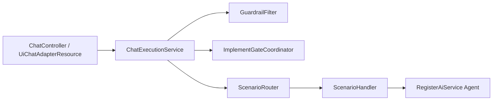
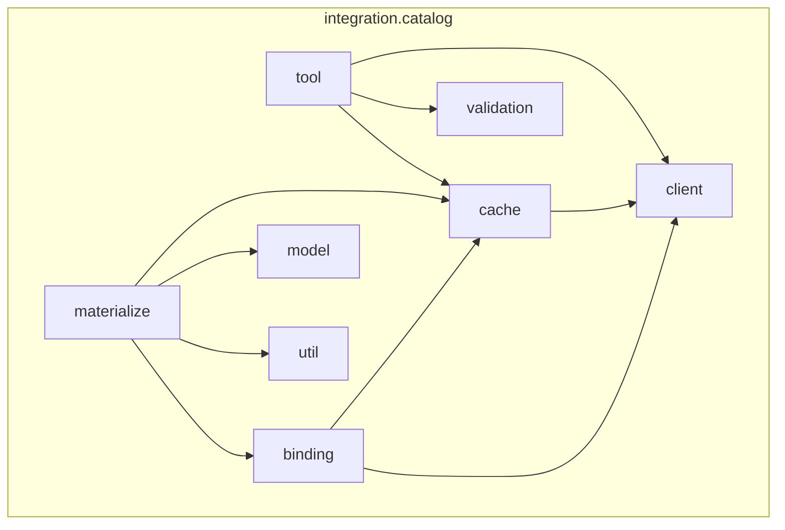

# AI Service (`ai-service`) — architecture

Quarkus + LangChain4j service for QIP chain design, planning, and catalog implementation.

Maven artifact: `qubership-integration-ai-service`. Lives in the [qubership-integration-platform](https://github.com/Netcracker/qubership-integration-platform) monorepo at `ai-service/` (sibling of `schemas/`, `ui/`, `runtime-catalog/`, etc.). See [README.md](README.md) for build and run commands.

## Request flow



1. REST maps UI/v1 payloads to `ChatRequest`.
2. `ChatExecutionService` resolves conversation id and effective user text, records planning diary hints, updates active chain plan state.
3. Guardrail may short-circuit with a refusal SSE stream.
4. If Gate 2 is pending, `ImplementGateCoordinator` runs blocking HITL before `ScenarioRouter`.
5. `ScenarioRouter` classifies intent (phase policy → heuristics → embeddings → `RouterAgent` LLM) and selects a `@ForScenario` `ScenarioHandler`.
6. Handler augments the prompt (RAG, diary, plan appendix) and streams tokens from the scenario agent.

## Gates

| Gate | When | Mechanism |
|------|------|-----------|
| Gate 1 — plan approval | User confirms `ChainImplementationPlan` | HITL (`Agree,Modify plan`) + UI `approve-for-build` + LLM classifier (`PlanApprovalGate`) |
| Gate 2 — implement | Plan approved, before `IMPLEMENT_CHAIN` | `ImplementGateCoordinator` server HITL or UI `scenarioHint=IMPLEMENT_CHAIN` |

`ActiveChainPlanService` holds conversation-scoped plan snapshots, approval flags, and implement-gate state.

## Packages

| Package | Role |
|---------|------|
| `chat` | HTTP, execution pipeline, conversation, guardrail, HITL, chain plan state |
| `llm` | Agents, scenario handlers, routing |
| `integration.catalog` | Catalog integration (subpackages below); root has `package-info` only |
| `catalog.descriptor` | **Local** element descriptor YAML (not the HTTP catalog API) |
| `schema` | QIP element schema load/validate for deterministic patches (`legacy` or `networknt` via `qip.ai.schema.validation.engine`); see [QIP schemas](#qip-schemas-build-time) |
| `integration.apihub` | API Hub MCP tools |
| `rag` | Document retrieval for prompt augmentation |
| `storage` | S3 attachments |

## ScenarioType → Agent → Tools

| ScenarioType | ScenarioHandler | Agent | Tools (high level) |
|--------------|-----------------|-------|-------------------|
| CREATE_DESIGN | CreateDesignScenario | CreateDesignAgent | ApiHubMcpTools, HitlTool |
| ASK_DESIGN | AskDesignScenario | AskDesignAgent | CatalogSystemTools (read-only; mutations guarded), ApiHubMcpTools |
| CREATE_CHAIN_PLAN | CreateChainPlanScenario | CreateChainPlanAgent | ApiHubMcpTools, ElementSchemaTools, HitlTool, CatalogSystemTools (read-only; mutations guarded) |
| IMPLEMENT_CHAIN | ImplementChainScenario | ImplementChainAgent | ApiHubMcpTools, Catalog* tools, ElementSchemaTools, HitlTool, ChainPlanOpenDebtTool |
| COMPARE_AND_PATCH | CompareAndPatchScenario | CompareDesignAgent | Catalog* tools, HitlTool |
| CHAIN_TO_DESIGN | ChainToDesignScenario | ChainToDesignAgent | ApiHubMcpTools, Catalog* tools |
| CREATE_TEST_CASES | CreateTestCasesScenario | CreateTestCasesAgent | (none) |
| CREATE_POSTMAN_COLLECTION | CreatePostmanScenario | CreatePostmanAgent | (none) |
| UNKNOWN | DefaultScenario | DefaultAgent | ApiHubMcpTools, Catalog* tools |

Routing-only: `RouterAgent` (no tools). Guardrail: `GuardrailService`.

\* LangChain4j tool beans live in `integration.catalog.tool` (see [Catalog package layout](#catalog-package-layout)).

## Catalog package layout

`integration.catalog` is split by responsibility. Agents register tool classes from `tool.*` on `@RegisterAiService`.



| Subpackage | Role |
|------------|------|
| `tool` | LangChain4j `@Tool` beans, `CatalogToolSupport` / `CatalogToolResult`, mutation guard, read delegate wiring |
| `client` | `CatalogRestClient`, outbound logging filter |
| `cache` | `ConversationCatalogCache`, operations/element read caches, lookup facade |
| `validation` | Read/import tool arg validation; `CatalogSystemToolNames` |
| `binding` | Operation binding resolver, applicators, enrich result |
| `materialize` | Plan → chain orchestration (former `service/`) |
| `model` | Catalog DTOs (unchanged package) |
| `util` | `CatalogStrings`, `CatalogIdPatterns`, REST/diff helpers |

### Catalog tools (`tool`)

| Class | Responsibility |
|-------|----------------|
| `CatalogChainTools` | createChain, getChain |
| `CatalogElementTools` | element CRUD, createElementsByJson, updateElement |
| `CatalogConnectionTools` | dependencies / connections |
| `CatalogSystemTools` | searchCatalogSystems, getApiSpecifications, listCatalogOperations; createSystem, import (mutations) |
| `CatalogSystemReadTool` | shared read HTTP + conversation cache; arg validation; binding uses `GET /operations/{id}` |
| `CatalogCatalogMutationGuard` | blocks catalog writes in CREATE_CHAIN_PLAN / ASK_DESIGN (MDC scenarioType) |

`ScenarioRouter` sets `ChatMdc.SCENARIO_TYPE` for the stream lifetime. `CatalogOperationBindingResolver` may `GET /v1/systems/{id}` when system metadata is missing from cache.

### Catalog operation binding (UI-like)

Package `integration.catalog.binding`: enriches service-bound element properties at materialize (plan carries `integrationOperationId` as canonical binding key; catalog fills system/spec/group/method/path).

| Component | Role |
|-----------|------|
| `CatalogOperationLookup` | Resolve `OperationDto` + system protocol from `ConversationCatalogCache` / catalog HTTP |
| `OperationBindingCore` | Canonical fields from operation (path, method, protocol, systemType) |
| `OperationBindingApplicator` | Per-type overlay rules (`ServiceCallBindingApplicator`, `HttpTriggerBindingApplicator` for implemented endpoint only, `AsyncApiTriggerBindingApplicator`) |
| `CatalogOperationBindingResolver` | Facade used by `materialize.ChainPropertiesApplier` before PATCH |
| `OperationBindingMergeNormalizer` | Post-merge cleanup in `materialize.CatalogPatchPreparationService` (strip stale GQL/custom keys from catalog skeleton) |

### Catalog HTTP caches (Quarkus Cache / Caffeine)

| Cache name | Bean | Purpose |
|------------|------|---------|
| `catalog-operations-by-model` | `CatalogOperationsReadCache` | Paginated `GET` operations per specification `modelId` (shared across conversations) |
| `catalog-element` | `CatalogElementReadCache` | Short-TTL `GET` element during patch preparation bursts |

Per-conversation indexes (`activeSystemId`, operation id lookup) remain in `ConversationCatalogCache`.

### Element PATCH schema validation

| Setting | Default | Notes |
|---------|---------|--------|
| `qip.ai.schema.validation.engine` | `legacy` | Custom `ElementPatchValidator` |
| `networknt` | — | Pilot types in `qip.ai.schema.validation.networknt.element-types` (`service-call`, `http-trigger`); falls back to legacy when schema graph is too cyclic |

## QIP schemas (build-time)

Element and conf-model YAML are **not** stored under `ai-service/src/main/resources/`. The source of truth is the monorepo [**schemas**](../schemas/) module:

| Path | Role |
|------|------|
| [`schemas/src/main/resources/qip-model/`](../schemas/src/main/resources/qip-model/) | Authoritative `qip-model` tree (same as UI / vscode-extension) |
| `ai-service/scripts/fetch-qip-schemas.sh` | Copies `qip-model` into `target/qip-schemas-staging/qip-schemas` during Maven `generate-resources` |
| `target/classes/qip-schemas/` | Runtime classpath bundle (`SchemaResourceLoader`, RAG ingestion, NetworkNT pilot) |

Maven properties in `ai-service/pom.xml`: `qip.schemas.sync.skip=false`, `qip.schemas.local.dir=${project.basedir}/../schemas/src/main/resources/qip-model`. Optional `-Pschemas-from-download` fetches a tarball when building outside this monorepo.

Schema `$id` / `$ref` URIs use the `http://qubership.org/schemas/product/qip/` prefix (`QipConfModelUris`). Classpath layout is unchanged: `qip-schemas/element/{type}.schema.yaml`.

Supplementary prose for agents lives in `src/main/resources/docs/` (e.g. UI label → PATCH key mapping). Update those notes when enum tables drift from `schemas/`.

## Chat memory

| Layer | Role |
|-------|------|
| `quarkus.langchain4j.chat-memory.type=TOKEN_WINDOW` | Agent memory window (default ~24k tokens via `CHAT_MEMORY_MAX_TOKENS`; raised for inlined IDS + catalog tool history) |
| `QipJtokkitTokenCountEstimator` | Local Jtokkit token counting (no HTTP during streaming) |
| `ConversationBackedChatMemoryStore` | LangChain4j `ChatMemoryStore` → same in-memory list as REST history |
| `qip.ai.conversation.max-messages` | Upper bound on stored rows (default 100); FIFO trim only |

Tool results from agents are persisted as `SYSTEM` messages with a `[Tool]` prefix (v1 limitation). `ChatExecutionService` still appends USER/ASSISTANT with idempotent tail checks; LangChain4j `updateMessages` replaces the full list after each agent turn.

`GuardrailService` and `RouterAgent` use `NoChatMemoryProviderSupplier` (stateless classifiers; transcript is passed in the user prompt, not LangChain4j memory). Scenario agents use `@MemoryId` + the store above.

Guardrail and router transcripts read `ConversationService.formatRecentTranscriptBalanced` (same store).

Configurable limits: `qip.ai.guardrail.transcript.*`, `qip.ai.router.transcript.*`.

## Prompt assembly

`ConversationPromptAssembler` + `PromptProfile` build the user message for `agent.chat()` in fixed order:

1. RAG (when profile uses it; query = truncated `ChatRequest.getEffectiveUserText()`, else `getMessage()`)
2. Authoritative state (`ConversationPhase`, plan status, recent diary tail)
3. Planning diary appendix
4. Chain plan appendix
5. APIHub runtime note (planning / implement profiles)
6. User block (`## User Request` + effective text, or plain text for implement)

Scenario handlers delegate to the assembler; special cases remain in handlers (e.g. implement refusal without approved plan, CREATE_DESIGN artifact footer).

## DI convention

Prefer constructor injection for new or refactored `@ApplicationScoped` beans. Legacy field `@Inject` is left unchanged unless the class is already being edited.

## Tests

From the monorepo root (requires a resolvable reactor; if other modules fail to resolve, use the module directory):

```bash
mvn -pl ai-service test
```

From `ai-service/`:

```bash
./mvnw test
# or full verify (unit + Quarkus augmentation)
./mvnw verify
```

Run `compile` or `verify` before `quarkus dev` so `target/classes/qip-schemas/` is populated from `../schemas/`.

Key suites: `ActiveChainPlanService*Test`, `ImplementGateCoordinatorTest`, `CatalogApiToolsContractTest`, `PhaseRoutingPolicyTest`, `SchemaResourceLoaderTest`.
