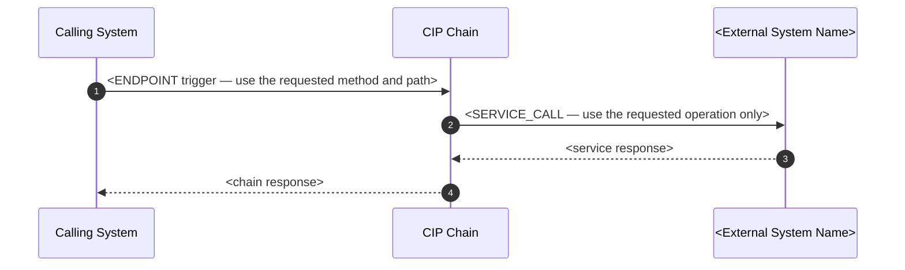

# Integration Design Specification (IDS)

> **Authoring constraint:** Treat the approved requirement brief and supplied evidence as the only sources of facts.
> Do not invent endpoints, service calls, parameters, mappings, response codes, assumptions, identifiers, or
> configuration values. Omit unsupported rows or sections instead of completing them with plausible examples.

**Document ID:** <generate_document_id>
**Version:** <current_version>
**Document Date:** <current_date>
**System ID:** <system_id>
**Owner:** —
**Approval Status:** —
**JIRA Link:** —

---

## Document Metadata

| Field | Value |
|-------|-------|
| Integration ID | <generate_document_id> |
| System | <3rdPartySystemName> |
| Domain | — |
| Functional Capabilities | — |
| Design Items | — |
| Comments | — |

---

## Version History

| Version | Date | Author | Description of Changes |
|---------|------|--------|------------------------|
| <current_version> | <current_date> | <user_name> | <comment> |

---

## Document References

| # | Name | Description |
|---|------|-------------|
| 1 | <IA_id> | Reference to <3rdPartySystemName> IA |

---

## Glossary of Terms

| Acronym | Interpretation |
|---------|----------------|
| NC | Netcracker |
| CIP | Qubership Integration Platform |
| API | Application Programming Interface |
| CIM | Customer Information System |
| SOAP | Simple Object Access Protocol |
| HTTP | Hypertext Transfer Protocol |
| <3rdPartySystemAbbreviation> | <3rdPartySystemName> |

---

## Introduction

### Document Purpose

This document is intended to define and describe integrations and interfaces design as supported by Netcracker in order to communicate with <3rdPartySystemName> in scope of the <project_name> project.

### Document Objectives

The objectives of the document to provide a high level understanding of:

- Integration process describing interaction between Netcracker functional modules and Integration layer.
- Process of calling 3rd party API's and methods.
- Data mapping between functional model and integration methods/API's.
- Integration interface configuration.
- Response handling rules.
- Error handling process.

### Intended Audience

This document is intended for nominated business, 3rd party vendors and IT representatives to verify alignment of the proposed solution with the requirements of Trappist program as well as for further use by system developers and by test teams.

### Assumptions

| # | Description | Status |
|---|-------------|--------|
| <assumption_id> | <requirement-backed assumption> | <status> |

### Out of Scope

| # | Description |
|---|-------------|
| <out_of_scope_id> | <requirement-backed exclusion> |

---

## Technical Design

This design document describes the interface for the integration scenarios between Netcracker and <3rdPartySystemName> system.

### Authentication & Authorization

<authentification>

### Integration Scenarios

Integration Scenarios will be same as defined in IA: <3rdPartySystemName> Scenarios

---

## Integration Process

### Integration flow for CIP Chain - <Process Name>

<description_of_the_process>

Process flow is demonstrated in the form of interaction diagram as follows:

> **Diagram rules:** Use **only** `sequenceDiagram` blocks (as many as needed). Represent every `ENDPOINT` as an
> inbound `Caller ->> CIP` message and every `SERVICE_CALL` as an outbound `CIP ->> external participant` message.
> Do not represent an endpoint as an outbound service call. Include only interactions stated in the requirements. Do
> not use flowchart, graph, dot/digraph, stateDiagram, or other Mermaid types.

#### Process Steps

| Process Step | Description |
|--------------|-------------|
| 1 | <step_name and description> |

---

## Data Mapping

### Operation: <Operation Name>

This covers the mapping of <System Name> interface attributes with upstream or internal system.

**Path:** `<method> <path>`

This covers the mapping of Operation Name interface exposed by <System Name> for <description_of_operation>

#### Request Mapping

| Request Parameter | Description | Type | Mandatory | Provided By |
|-------------------|-------------|------|-----------|-------------|
| <field> | <field_description> | <field_type> | <field_mandatoriness> | TBD |

<request_sample>

#### Response Mapping

**Success Response**

| Name | Description | Length | Type | Occurrence | Mandatory | Transformation Logic |
|------|-------------|--------|------|------------|-----------|----------------------|
| <field> | <field_description> | <field_length> | <field_type> | <field_occurencee> | <field_mandatoriness> | TBD |

<success_response_sample>

**Error Response**

| Response Parameter | Description | Type | Mandatory | Provided By |
|--------------------|-------------|------|-----------|-------------|
| <field> | <field_description> | <field_type> | <field_mandatoriness> | <provider> |

<error_response_sample>

---

## Error Handling

Error handling supports retrying failed requests based on the predefined configuration or forwarding errors to the
caller for resolution.

### Error Codes - <3rdPartySystemName> (<Operation Name>)

| Operation | Error from <3rdPartySystemName> | Error Description | Error Type | Occurred When | Technical Resolution | Ownership | Frequency | Notes |
|-----------|----------------------|-------------------|------------|---------------|------------------------|-----------|-----------|-------|

---

## Logging

This section describes the logging considerations to be taken care for various outbound and internal APIs.

**Objective:** Request/response body having PII data should not be logged in full

| Attribute Name | API name | Masked | Example |
|----------------|----------|--------|---------|
| <pii_field> | <Operation Name> | Y (<Show only last 2 digits and mask the remaining by using x>) |

---

## Integration Configuration

List only configuration parameters stated in the approved brief or supplied evidence.

| Sl.Num. | Parameter Name | Default Value | Notes |
|---------|----------------|---------------|-------|
| 1 | URL | Example: https://server:port/ | — |
| 2 | Number of Retries | 3 | In case of connection error/timeout |
| 3 | Delay between retries (in sec) | 10 secs | Delay between each command retry |

---

## Appendix

| # | Description | Status |
|---|-------------|--------|
| — | — | — |

---

## Questions

Following are the open questions applicable for this design:

| # | Description | Author | Date | Owner | Jira Ticket | Status |
|---|-------------|--------|------|-------|-------------|--------|
| <question_id> | <description> | <author> | <date> | <owner> | <jira_ticket> | <status> |
