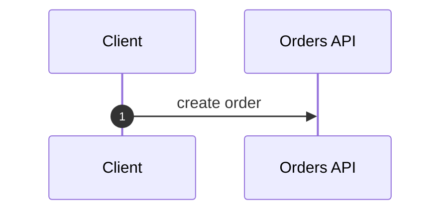

# Integration Design Specification

## Integration Process

### Integration flow for CIP Chain - Orders

#### Process Steps

| Process Step | Description |
|--------------|-------------|
| step-1 | create order |

#### Data Mappings

| Mapping ID | Stage | From | To | Mode | Source Facts |
|------------|-------|------|----|------|--------------|
| map-1 | INITIALIZATION | step-trigger | step-1 | PASS_THROUGH | fact-map |
