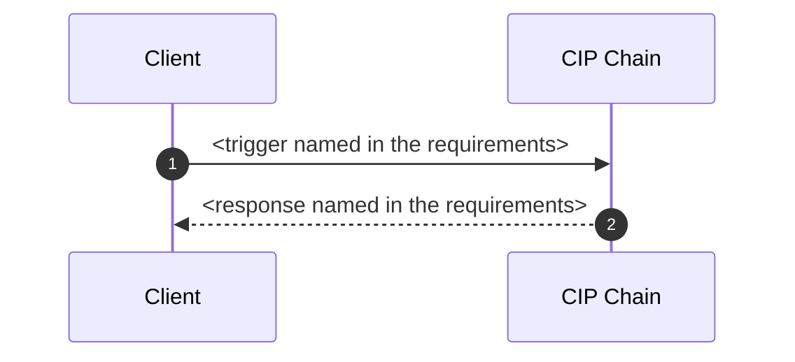

# cip-design-generator addon

## Upstream

- Source: `.apm/skills/cip-design-generator/SKILL.md`
- Hash: `c1fca215be4c76bcea837d44f836b4151e63d9ca5bc8c7403b76c6f4aa7a15d6`
- Template: `.apm/skills/cip-design-generator/templates/ids_template.md`
- Template hash: `ccca941ac483a5fc7617e9f85b33b0771859ae2970cf6d28fc2d7240a0f55e77`
- Runtime mode: `PROCESS_REPORT`
- Status: `reviewed`

## Applicability in ai-service

- Authors a derived IDS view from the approved brief and its
  resolved catalog bindings. It has no APIHub tools. The IDS `sequenceDiagram` is an approval
  rendering of the pinned semantic revision. It is not compiler input, and markdown extraction
  does not feed planning or compilation.
- The template is owned by the upstream skill. ai-service does not copy it onto the classpath.
- Rejects invented operation bindings and non-sequence Mermaid diagrams in the generated IDS.
- Not a GraphPatch skill. Do not invent empty GraphPatch examples.

## Runtime rules

These apply to every IDS this skill authors for ai-service.

**Where they are enforced:** `ChainSemanticIdsRenderer` renders the IDS approval view from the
pinned semantic revision. The rules below are carried by `DesignInputCapability.authoringPrompt`,
which builds the agent's user message. Change them there; this section records the intent so the
two do not drift apart silently.

### API resolution is complete before IDS authoring

The approved brief is the only source of service participants and operation queries. Do not query
APIHub, import a specification, search for a substitute API, or replace a catalog binding while
authoring an IDS. When a service binding is unresolved, the requirement stage must return to API
resolution instead of asking the IDS author to discover it.

### Include only what the requirements name

Every participant, path, HTTP method, operation, and field mapping must come from the
requirements. Where the requirements are silent, leave the section out rather than filling it with
a plausible value. An invented outbound call does not stay on the page: it becomes a real element
of the chain, wired to a system that does not exist.

### A chain with no outbound call is a normal chain

The sequence diagram in the template shows an external participant because most chains have one.
That is a shape, not a floor. A chain that answers from its own logic — a fixed body, a computed
value, a transformed payload — talks to no external system, and its diagram holds the caller and
`CIP` alone:

Such a chain still has a process step: the one that builds the response. Write it as a script step
and describe what it produces. Do not add an external participant to give the diagram a second
column.

## Examples

- none
