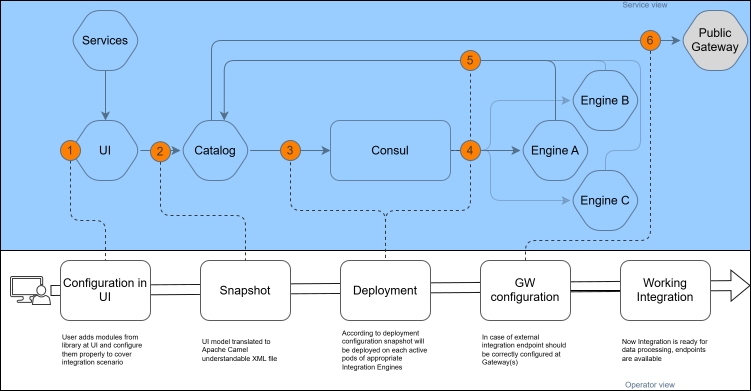

# Getting Started

## Description

---

Cloud Integration Platform (CIP) connects systems that do not speak the same protocol or the same data format.
You describe each integration task as a **chain**: an ordered set of elements that receives a request, transforms
and routes the data, and returns a response. You design chains in the UI, and Apache Camel executes them on an
engine — so the design side and the execution side stay separate.

This walkthrough builds one minimal chain from an empty **Chains** page to a completed session. It takes you through
the parts of the product you use every day, and every other page in the documentation hangs off one of these steps.

## Five Terms to Know First

---

| Term                                                      | Meaning                                                                                                                                               |
|-----------------------------------------------------------|-------------------------------------------------------------------------------------------------------------------------------------------------------|
| [Chain](../4__Glossary/glossary.md#chain)                 | An integration configuration made of Apache Camel (or customized) modules, intended to perform one particular integration task.                       |
| [Element](../4__Glossary/glossary.md#element)             | A single building block inside a chain — a trigger, a transformation, a sender, a container. You drag elements onto the graph from the library panel. |
| [Snapshot](../4__Glossary/glossary.md#snapshot)           | A chain state captured at a particular moment. Snapshots are what you deploy; a chain cannot be deployed in an intermediate state.                    |
| [Deployment](../4__Glossary/glossary.md#deployment)       | A snapshot placed onto a specific engine domain. Until a chain is deployed, nothing can trigger it.                                                   |
| [Engine domain](../4__Glossary/glossary.md#engine-domain) | A Kubernetes deployment holding one or more engine pods. A chain deployed on a domain runs on every engine pod in that domain.                        |

The [Glossary](../4__Glossary/glossary.md) covers the rest of the vocabulary.

## How a Chain Reaches an Engine

---

Every chain travels the same path, whichever elements it contains: you configure it in the UI, capture it as a
snapshot, and deploy that snapshot onto an engine domain.



| #       | Step                | What happens                                                                                                                                                                                 |
|---------|---------------------|----------------------------------------------------------------------------------------------------------------------------------------------------------------------------------------------|
| 1       | Configuration in UI | You assemble the chain from elements — triggers, service calls, mappers, scripts — which together form a step-by-step instruction for the platform. A chain can also be imported rather than built by hand. |
| 2       | Snapshot            | The platform stores the chain's instructions as XML. A snapshot is both a save point and a version, so you can always return to an earlier one.                                               |
| 3, 4, 5 | Deployment          | Deploying a snapshot applies it to a particular engine with particular logging settings. Each engine then retrieves the chain details it needs from the catalog over REST.                     |
| 5       | GW Configuration    | An endpoint reachable from outside the cluster also needs gateway setup. That happens outside the platform and is handled by the group that owns the environment.                             |

The walkthrough below performs steps 1 through 3 in the UI.

## Build Your First Chain

---

The steps below use the Web UI. Where the VS Code Extension differs, the linked reference page says so.

### 1. Create the Chain

On the **Chains** page, click **"Create"** in the top right and select **"New chain"**. In the **"General Info"** tab,
enter a **Name**, then click **"Submit"** (or press **`Ctrl+Enter`**). Select **Open chain** before submitting to go
straight to the new chain.

**Labels**, **Description**, and the **"Extended Description"** tab are optional. See
[Chains](../../01__Chains/chains.md) for the full dialog.

### 2. Add an HTTP Trigger

Click the chain name in the table to open its [Graph](../../01__Chains/1__Graph/graph.md) — the blueprint-like
canvas where you assemble the chain.

Find **HTTP Trigger** in the left library panel and drag it onto the graph. Double-click it to open its
configuration, then on the **"Endpoint"** tab select the **"Custom"** URI source and fill in **URI**, for example
`/routes/myChain`. **HTTP Methods** is optional: leave it empty and every method can trigger the chain.

See [HTTP Trigger](../../01__Chains/1__Graph/1__Elements_Library/6__Triggers/1__HTTP_Trigger/http_trigger.md) for the
remaining tabs — request validation, failure response mapping, idempotency, and access control.

### 3. Add a Transformation

Drag a [Script](../../01__Chains/1__Graph/1__Elements_Library/5__Transformation/1__Script/script.md) element onto the
graph, then connect it to the trigger: drop one element onto the other, or hover over the white dot on the trigger's
right border and drag a connection line to the Script.

Open the Script element and write the transformation on the **"Script"** tab in Groovy. This one replaces the
message body:

```groovy
exchange.getMessage().setBody("Body")
```

For field-by-field mapping between two schemas, use the
[Mapper](../../01__Chains/1__Graph/1__Elements_Library/5__Transformation/2__Mapper/mapper.md) element instead.

### 4. Create a Snapshot

The graph saves chain configuration to the catalog database as you edit it, but editing is not the same as
versioning. The **"Unsaved changes"** label above **"Save and Deploy"** means the current graph is not in any
snapshot yet.

Open the **"Snapshots"** tab and click . If the graph is valid,
the snapshot is created and named **V1**; later snapshots increment the number. See
[Snapshots](../../01__Chains/2__Snapshots/snapshots.md) for renaming, reverting, and comparing versions.

### 5. Deploy to an Engine Domain

Open the **"Deployments"** tab and click **"Create deployment"**. Fill in:

- **Domains** — one or more engine domains to deploy the snapshot on. Select an existing domain, or type a name that
  does not exist yet to deploy on a new **Micro** domain. See
  [Domains](../../03__Admin_Tools/1__Domains/domains.md) for the difference between **Classic** and **Micro**.
- **Snapshot** — the version to deploy. Pick **V1**.

Click **"Deploy"**. The **Status** column moves from **_Progressing_** to **_Deployed_** once every requested engine
has confirmed. On **_Failed_**, hover over the engine's status to read the error.

> ℹ️ **Note:** A chain must be deployed on at least one engine domain, otherwise it cannot be triggered.

### 6. Call the Endpoint

A deployed HTTP Trigger is always reachable from inside the Kubernetes network at:

```text
http://Cloud-integration-platform-engine:8080/routes/{{specified uri}}
```

To reach it from outside, mark **External route** or **Private route** on the trigger's **"Parameters"** tab and
redeploy. The endpoint then also answers on the public or private gateway:

```text
https://public-gateway-{{namespace}}.{{environment}}/cip-routes/{{specified uri}}
https://private-gateway-{{namespace}}.{{environment}}/cip-routes/{{specified uri}}
```

Both checkboxes are inactive when route registration is turned off by global environment settings.

### 7. Read the Session

Each successful trigger creates a **session** — the record of the chain processing your request step by step. Open
the **"Sessions"** tab and click the **ID** value to list the elements that took part, with their status, duration,
and start and finish times.

Click an element name to inspect what it did: the **Body** tab shows the payload before and after, **Headers** and
**Exchange properties** show the before and after values of each entry, and **Technical context** lists the context
headers the chain received.

> ℹ️ **Note:** Session records are populated according to the logging level set for the chain. If the **"Sessions"**
> tab stays empty, check the chain's [Logging](../../01__Chains/5__Logging/logging.md) tab — **Sessions logging
> level** of **Off** records nothing.

See [Sessions](../../01__Chains/4__Sessions/sessions.md) for searching, exporting, and retrying sessions.

## Where to Go Next

---

**Building integrations.** Work through the element library from
[Graph](../../01__Chains/1__Graph/graph.md) — triggers, senders, routing, transformation, and grouping. Read
[Apache Camel Context Concept](../1__Apache_Camel_Context_Concept/apache_camel_context_concept.md) to understand
what the Exchange object carries between elements. When a chain has to call a real system, register it under
[Services](../../02__Services/services.md) first.

**Recurring tasks.** [How To](../../05__How_To/how_to.md) collects the discrete procedures: restricting a chain by
access control, switching connection management to MaaS, retrying a session from the middle.

**Administering the platform.** [Admin Tools](../../03__Admin_Tools/admin_tools.md) covers domains,
[variables](../../03__Admin_Tools/2__Variables/variables.md), audit, import instructions, and access control.
[Observability](../../06__Observability/observability.md) covers the logs and metrics the platform produces,
[Troubleshooting](../../07__Troubleshooting/troubleshooting.md) maps symptoms to likely causes, and
[Features](../../08__Features/features.md) documents system properties, token processing, retention, and
multitenancy.

**Understanding the platform.** [Architecture](../3__Architecture/cip_architecture.md) maps the components and says
where each kind of data lives. [Token Processing](../../08__Features/2__Token_Processing/token_processing.md) explains how
authentication tokens travel through a chain.

**Handling sensitive data.** Configure [Masking](../../01__Chains/6__Masking/masking.md) before a chain starts
logging payloads that contain credentials or personal data.
