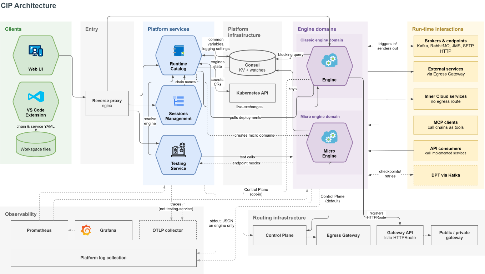

# Architecture

## Description

---

Cloud Integration Platform splits design from execution. One service holds the catalog of everything you design —
chains, services, snapshots, deployments, variables — and exposes the API the clients use. Separate engine services
run the designed chains on Apache Camel. A third service owns session search. The clients, the Web UI and the VS Code
Extension, hold no integration data of their own.

This page maps those components, names the store behind each kind of data, and traces the two flows that connect
them: design time and runtime.

## Components

---

| Component               | Role                                                                                                                                                                                                                                                             | Built on                    |
|-------------------------|------------------------------------------------------------------------------------------------------------------------------------------------------------------------------------------------------------------------------------------------------------------|-----------------------------|
| **Runtime Catalog**     | The design-time catalog and the platform API. Holds chains, snapshots, deployments, services and their API specifications, and variables. Orchestrates engine domains through the Kubernetes API, and compiles each chain into the configuration an engine runs. | Spring Boot, Java 21        |
| **Engine**              | Executes deployed chains. One engine is one pod; a [Classic engine domain](../../03__Admin_Tools/1__Domains/domains.md) is a Kubernetes deployment of one or more of them. Writes session logs, exposes metrics, holds checkpoints and scheduled triggers.       | Spring Boot, Apache Camel 4 |
| **Micro Engine**        | The same Camel runtime packaged for a **Micro** engine domain — a Camel K custom resource provisioned on demand that runs only the chains deployed to it.                                                                                                        | Quarkus, Apache Camel 4     |
| **Sessions Management** | Session storage, search, export, and import. Reads the session index the engines write, and resolves chain names against the Runtime Catalog.                                                                                                                    | Spring Boot, Java 21        |
| **Web UI**              | The browser client. Renders the chain graph, the element library, and every admin screen, and serves this documentation as a static asset.                                                                                                                       | React, Vite                 |
| **VS Code Extension**   | The offline client. Edits chain and service files in your workspace and embeds the Web UI bundle, so chains designed there live on your file system instead of in the catalog.                                                                                   | VS Code web extension       |

Three backing services sit behind the platform: **PostgreSQL**, **OpenSearch**, and **Consul**. The next section says
which data goes where.

## Data Storage

---

| Data                                                                                                                                     | Where it lives                                                                                      | Notes                                                                                                                                                |
|------------------------------------------------------------------------------------------------------------------------------------------|-----------------------------------------------------------------------------------------------------|------------------------------------------------------------------------------------------------------------------------------------------------------|
| Chains and chain graphs                                                                                                                  | PostgreSQL, Runtime Catalog's `catalog` schema                                                      | Saved as you edit, in real time. Chains designed in the VS Code Extension are files on your file system instead.                                     |
| [Snapshots](../../01__Chains/2__Snapshots/snapshots.md)                                                                                  | PostgreSQL, `catalog` schema                                                                        | An XML representation of the chain state. A scheduled task deletes snapshots older than the configured interval, 14 days by default.                 |
| [Deployments](../../01__Chains/3__Deployments/deployments.md)                                                                            | PostgreSQL, `catalog` schema                                                                        |                                                                                                                                                      |
| [Services](../../02__Services/services.md), API specifications, environments                                                             | PostgreSQL, `catalog` schema                                                                        | Applies to all five service types.                                                                                                                   |
| [Common variables](../../03__Admin_Tools/2__Variables/variables.md)                                                                      | Consul key-value store                                                                              | Under the namespace's `variables/common` key. Values are visible in the UI.                                                                          |
| Secured variables                                                                                                                        | Kubernetes secrets                                                                                  | Values are hidden in the UI.                                                                                                                         |
| Per-chain and default [logging settings](../../01__Chains/5__Logging/logging.md)                                                         | Consul key-value store                                                                              | Cached by the platform for fast, stable access. Consul has the highest priority; the platform falls back to its own defaults when Consul holds none. |
| [Session logs](../../01__Chains/4__Sessions/sessions.md)                                                                                 | OpenSearch, index `qip-elements-<namespace>-session-elements`                                       | Written by the engines, read by Sessions Management. Subject to retention and sampling settings.                                                     |
| [Checkpoints](../../01__Chains/1__Graph/1__Elements_Library/3__Composite_Triggers/1__Checkpoint/checkpoint.md) and session retry records | PostgreSQL, engine database `engine_checkpoints_db`, schema `engine`                                | Cleaned up on a schedule. This is retry bookkeeping, not the session log.                                                                            |
| Scheduler state for time-based triggers                                                                                                  | PostgreSQL, engine database `engine_qrtz_db`, schema `engine`                                       | Quartz job store.                                                                                                                                    |
| Idempotency keys                                                                                                                         | PostgreSQL, engine database `engine_checkpoints_db`, schema `engine`                                | Expire after the key expiration time configured on the trigger.                                                                                      |
| [Audit](../../03__Admin_Tools/3__Audit/audit.md) (action) logs                                                                           | The platform's PostgreSQL database                                                                  | Retention configured at installation time.                                                                                                           |
| Chain context data                                                                                                                       | The database instance registered as the [Context service](../../02__Services/4__Context/context.md) | Owned by the service you register, not by the platform.                                                                                              |
| DPT events                                                                                                                               | Not stored by the platform                                                                          | Pushed to DPT over Kafka; they remain in the topic only while being processed.                                                                       |
| Microservice logs                                                                                                                        | Not stored by the platform                                                                          | Written to standard output and collected by the surrounding platform.                                                                                |
| Tracing data                                                                                                                             | Not stored by the platform                                                                          |                                                                                                                                                      |

> ℹ️ **Note:** Retention and sampling are what make a session disappear from the **Sessions** tab. See
> [Retention Settings](../../08__Features/3__Retention_Settings/retention_settings.md) and
> [Platform Logging](../../06__Observability/1__Platform_Logging/logging.md) for the variables that control them.

Under the multitenancy model, each tenant's data is isolated on the database level through DBaaS, so a user reaches
only the chains and services of their own tenant. See
[Database Multitenancy](../../08__Features/4__Database_Multitenancy/database_multitenancy.md) for the constraints
that still apply.

## Design-Time Flow

---

Design time ends the moment a deployment record exists. Nothing runs yet.

1. You build a chain in the Web UI, or edit chain files in the VS Code Extension. The Web UI writes every change
   straight to the Runtime Catalog, which stores it in the `catalog` schema.
2. Creating a [snapshot](../../01__Chains/2__Snapshots/snapshots.md) freezes that state as a versioned XML
   representation, still in the `catalog` schema. Only a snapshot can be deployed.
3. Creating a [deployment](../../01__Chains/3__Deployments/deployments.md) records that one snapshot belongs on one
   engine domain, and compiles the chain into the configuration an engine can run.
4. The Runtime Catalog signals the change by updating a timestamp key in Consul. It does not push the configuration
   itself.

[Getting Started](../0__Getting_Started/getting_started.md#how-a-chain-reaches-an-engine) shows the same flow as a
diagram.

## Runtime Flow

---

1. **Each engine notices the change.** Engines watch the Consul timestamp key with a blocking query, so a deployment
   is picked up within seconds rather than on a fixed polling interval.
2. **Each engine pulls what it needs.** On a change, the engine calls the Runtime Catalog over REST for the
   deployments its own domain is missing, and the catalog answers with just the difference. A **Micro** domain works
   differently: the Camel K resource loads its chain configuration from the location the catalog published for it,
   rather than polling.
3. **The engine starts the Camel routes.** The chain's status moves to **_Deployed_** once every requested engine
   confirms; a failure on any engine shows as **_Failed_** with the reason on the engine's status.
4. **A trigger fires and a session begins.** Camel creates an Exchange object carrying properties, headers, and body,
   and passes it from element to element. See
   [Apache Camel Context Concept](../1__Apache_Camel_Context_Concept/apache_camel_context_concept.md).
5. **The engine records the session.** Each logged element is written to the OpenSearch session index at the level
   configured for the chain. Fields listed on the chain's [Masking](../../01__Chains/6__Masking/masking.md) tab are
   masked in what gets logged. Engines also expose metrics, described in
   [Metrics & Session Monitoring](../../06__Observability/2__Metrics_And_Session_Monitoring/metrics_and_session_monitoring.md).
6. **You read the session.** The **Sessions** tab queries Sessions Management, which searches the same OpenSearch
   index and resolves chain names against the Runtime Catalog. Neither engine is involved in reading a session.

Outbound calls leave through one of two paths. A service inside the same Kubernetes environment is called directly; an
[External service](../../02__Services/1__External/external.md) over REST, SOAP, or GraphQL is called through the
Egress Gateway, where its environment address is registered when you create it.

## Constraints

---

- Changing a [design time variable](../4__Glossary/glossary.md#design-time-variable) does not affect a running chain.
  Its value is resolved at deployment, so redeploy the chain or restart the engine pod to pick up a new value.
- Switching an External service's environment requires redeploying every affected chain, because the new address has
  to be registered on the Egress Gateway.
- Chains designed in the VS Code Extension live on your file system, not in the catalog, and the
  [Snapshots](../../01__Chains/2__Snapshots/snapshots.md), [Deployments](../../01__Chains/3__Deployments/deployments.md),
  and [Sessions](../../01__Chains/4__Sessions/sessions.md) tabs are not available there.
