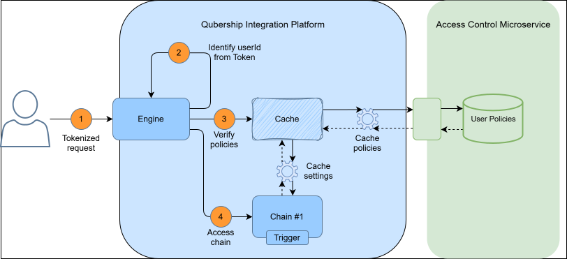

# Chain Availability Setup (Access Control)
## Description

---
Following the security practices and guidelines, Cloud Integration Platform has introduced an ability to integrate with **Access Control Microservice** in order to control the access to the endpoints, configured within [Chains](../../01__Chains/chains.md). When mentioned functionality is properly utilized, for each chain request Cloud Integration Platform performs a policy check and ensures, that calling system/user is actually allowed to trigger requested endpoint and start the logic, configured within related chain.

Please refer to the diagram below, that visually represents the flow:

**Diagram details**

| # | Description                                                                  |
|---|------------------------------------------------------------------------------|
| 1 | User or system calls specific endpoint, exposed by the CIP chain.            |
| 2 | Engine identifies the user from the token in request.                        |
| 3 | Engine verifies access, utilizing cached data.                               |
| 4 | If access granted, Cloud Integration Platform allows to trigger a chain. |

User will get **403 Forbidden** error if it has no access to the called endpoint.

**Custom Policies**

All sequentially added roles for each particular endpoint shall be specified manually. Please view configuration example below:

| Policy Name                | Permission: Resource     | Permission: Resource Type | Permission: Operation | Permission: Condition | Role #1 | Role #2 |
|----------------------------|-----------------------------|------------------------------|--------------------------|--------------------------|---------|---------|
| Trigger Chain via Endpoint | /cip-routes/chain/checkData | CIP-CHAIN                    | ALL                      | -                        | Allow   | Allow   |
| Trigger Chain via Endpoint | /chain/checkData            | CIP-CHAIN                    | RETRIEVE                 | -                        | Deny    | Allow   |
| Trigger Chain via Endpoint | /order/{orderId}/submit     | Order                        | SUBMIT                   | -                        | Allow   | Deny    |

Where **Resource, Resource Type, Operation** are values, configured on [HTTP Trigger](../../01__Chains/1__Graph/1__Elements_Library/6__Triggers/1__HTTP_Trigger/http_trigger.md) within a chain.

## Process Initialization

---

When Cloud Integration Platform receives a request to start a particular chain, it will check if chain's trigger has Access Control validation option selected. If option is selected, resource identifier and related fields will be fetched from HTTP Trigger and passed to Access Control with user and tenant values.

## User Interface

---
To make **Cloud Integration Platform** validating called resource against policies, stored in **Access Control**, it is required to select **"ABAC"** option and populate corresponding fields that identifies the resource for [HTTP Trigger](../../01__Chains/1__Graph/1__Elements_Library/6__Triggers/1__HTTP_Trigger/http_trigger.md) (Parameters tab). Policies shall be manually configured directly in Access Control.

## Data Storage

---

Security policies are stored in Access Control database.Cloud Integration Platform only stores resource type, resource name and operation, which is going to be used in validation.

## Configuration

---

Access Control policies shall be manually configured if required. Fields such as 'Resource type', 'Operation', 'Resource data type' and 'Resource' identifier shall be specified by user for HTTP Trigger.

## API Details

---
TBD

Simplified Access Control API is being utilized: [TBD]. For additional details, please refer to the [API Hub - TBD] folder.
