# Data Transformation via Mapper
## Description

---
There is an ability to alter input data from each available Mapper View:
- **Graph View** - click connection circle for target attribute when it is connected with one or multiple source attributes with connection arrow(s).
- **Table View** - click on "**Transformation**" field for target attribute when source attribute is specified in the table.
- **Text View**  - manually enter transformation setting with custom syntax, described in [main Mapper article](../mapper.md).

For **Graph** and **Table** views when transformation window is opened, it allows to:
- Select transformation option from the pre-defined list.
- Enter the transformation rules manually via Expression.
- Specify transformation description.

Scenarios, mapping structure, transformation settings and input/output samples are available in the tables below. While reviewing mentioned tables, note that parameters from all mapper sections, such as "Constants", "Headers", "Properties" and "Body", might participate in transformation.


>**ℹ️Note:** Tables below are only applicable for Graph and Table views.

### Quick Reference

| Function | Category | Description |
|---|---|---|
| [`concatenation`](#concatenation) | String | Concatenate fields with a separator |
| [`tolower`](#tolower) | String | Convert string to lowercase |
| [`trim`](#trim) | String | Remove leading/trailing spaces |
| [`replaceAll`](#replaceall) | String | Replace using regular expressions |
| [`arithmetic`](#arithmetic-operations) | Arithmetic | Numeric operations on fields |
| [`if`](#if) | Conditional | Conditional value selection |
| [`isempty`](#isempty) | Conditional | Check if value is empty |
| [`filterBy`](#filterby) | Array / Collection | Filter array by condition |
| [`getFirst`](#getfirst) | Array / Collection | Get first element from array |
| [`sort`](#sort) | Array / Collection | Sort array ascending or descending |
| [`map`](#map) | Array / Collection | Transform each element in array |
| [`list`](#list) | Array / Collection | Build list from values |
| [`getKeys`](#getkeys) | Object | Get field names from object |
| [`getValues`](#getvalues) | Object | Get field values from object |
| [`makeObject`](#makeobject) | Object | Build key/value map |
| [`mergeObjects`](#mergeobjects) | Object | Merge multiple objects into one |
| [`formatDateTime`](#formatdatetime) | Date / Time | Build formatted date/time string |
| [Dictionary](#dictionary) | UI Transformation | Match and replace with dictionary |
| [Format date/time](#format-datetime) | UI Transformation | Convert between date formats |
| [Conditional Transformation](#conditional-transformation) | UI Transformation | Condition with true/false values |
| [Default value](#default-value) | UI Transformation | Fallback for missing values |
| [Replace all](#replace-all) | UI Transformation | Replace via regex |
| [Trim](#trim-1) | UI Transformation | Strip spaces |

### Expressions

User might specify expression for mapped fields based on custom AtlasMap syntax. This option might be used when there is complex data transformation required to be performed against input data.
It is also possible to "replicate" transformations, which are available as options in the "Transformation" dropdown list.
For more convenient expression entering system displays prompts, which might be accessed via combination of Ctrl + Space.
Each function in the prompts is supplied with snippet, that contains detailed description and syntax. While working with expressions, the following notes shall be considered:
- Combination of different functions is available in a single transformation.
- It is required to use single quotes when specifying string in the expressions (e.g. 'String').

Table below contains a list of functions and scenarios as well as supportive information for their realization.

#### String Operations

##### Concatenation
Concatenation of two fields with "_" as a separator.

**Mapper structure sample:**

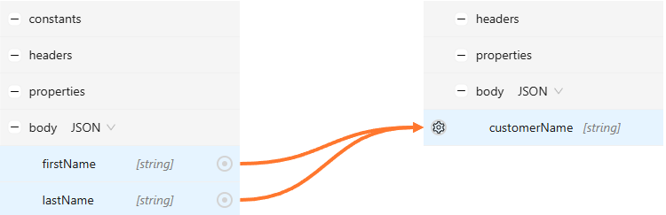

**Expression sample:**
```text
body.firstName + '_' + body.lastName
```

**Input data:**
```json
{
   "firstName": "John",
   "lastName": "Smith"
}
```

**Result:**
```json
{
   "customerName": "John_Smith"
}
```

##### tolower
Convert string value to lowercase.

**Mapper structure sample:**

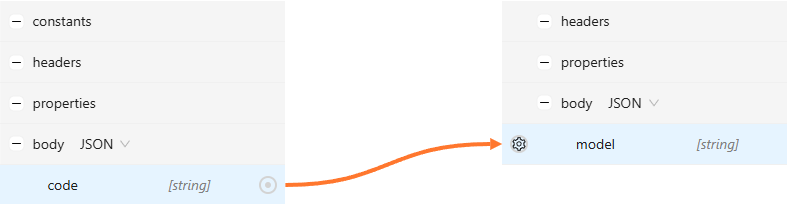

**Expression sample:**
```text
tolower(body.code)
```

**Input data:**
```json
{
   "code": "AL NT5634BLK"
}
```

**Result:**
```json
{
   "model": "al nt5634blk"
}
```

##### trim
Trim leading and trailing spaces from the string.

**Mapper structure sample:**


**Expression sample:**
```text
trim(body.description)
```

**Input data:**
```json
{
   "description": "        order123       "
}
```

**Result:**
```json
{
   "updatedDescription": "order123"
}
```

##### replaceAll
Put every word and underscores from the string in the round brackets.

**Mapper structure sample:**


**Expression sample:**
```text
replaceAll(body.description, '(\w[\w\d_]*)', '($1)')
```

**Input data:**
```json
{
   "description": "New order_1 has been created"
}
```

**Result:**
```json
{
   "updatedDescription": "(New) (order_1) (has) (been) (created)"
}
```

#### Arithmetic Operations
Expressions support the following list of arithmetic operators:
- "**+**" - allows to add one numeric value to another numeric value.
- "**-**" - allows to subtract a numeric value from another numeric value.
- "**/**" - allows to divide numeric values.
- "*****" - allows to multiply numeric values.
- "**%**" - allows to get remainder of division.

Mentioned operators shall be entered without quotes.

**Mapper structure sample:**

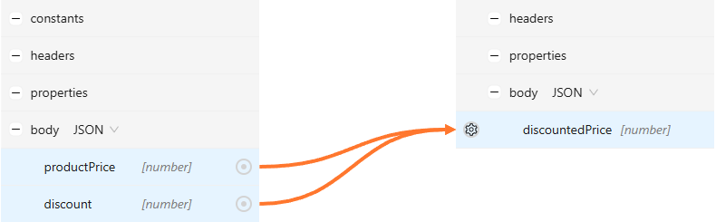

**Expression sample:**
```text
body.productPrice - body.discount
```

**Input data:**
```json
{
   "productPrice": 125,
   "discount": 20
}
```

**Result:**
```json
{
   "discountedPrice": 105
}
```

#### Conditional

##### if
Condition — select value based on comparison.

**Example 1: Basic comparison**

If two parameters are equal — pass "true", otherwise "false".

**Mapper structure sample:**

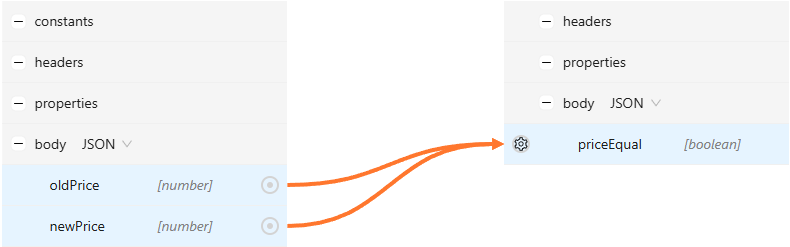

**Expression sample:**
```text
if (body.oldPrice == body.newPrice, true, false)
```

**Input data:**
```json
{
   "oldPrice": 125,
   "newPrice": 120
}
```

**Result:**
```json
{
   "priceEqual": false
}
```

**Example 2: Arithmetic operation within condition**

If remainder after param1 has been divided is not equal to 0, then "true", else "false".

**Mapper structure sample:**

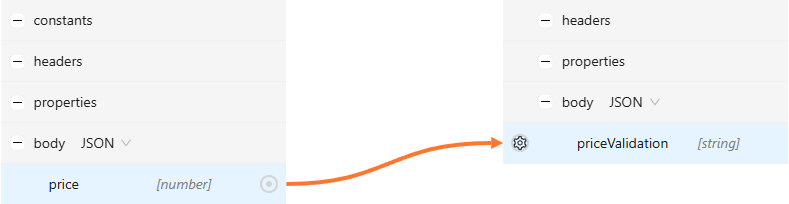

**Expression sample:**
```text
if(body.price % 2 != 0, 'true', 'false')
```

**Input data:**
```json
{
   "price": 125
}
```

**Result:**
```json
{
   "priceValidation": "true"
}
```

##### isempty
Check that value of source field is empty.

**Mapper structure sample:**

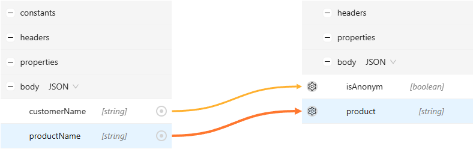

**Expression sample:**
```text
isempty(body.customerName)
```

**Input data:**
```json
{
   "productName": "Mobile Phone"
}
```

**Result:**
```json
{
   "isAnonym": true,
   "product": "Mobile Phone"
}
```

#### Array / Collection

##### filterBy
Pick all objects from the array, where field "value" is bigger than "2" (mentioned fields shall be connected).

**Mapper structure sample:**

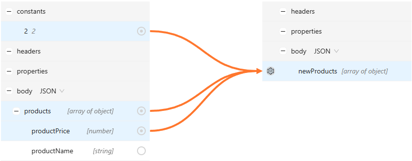

**Expression sample:**
```text
filterBy(
   body.products,
   body.products.productPrice > constant.2
)
```

**Input data:**
```json
{
   "products": [
      {
         "productName": "product1",
         "productPrice": 5
      },
      {
         "productName": "product2",
         "productPrice": 1
      },
      {
         "productName": "product3",
         "productPrice": 3
      }
   ]
}
```

**Result:**
```json
{
   "newProducts":[
      {
         "productPrice":5,
         "productName":"product1"
      },
      {
         "productPrice":3,
         "productName":"product3"
      }
   ]
}
```

##### getFirst
Get first object from the array.

**Example 1: Basic usage**

**Mapper structure sample:**

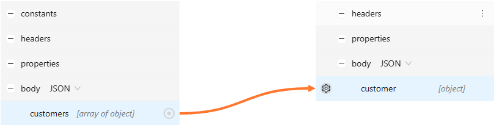

**Expression sample:**
```text
getFirst(body.customers)
```

**Input data:**
```json
{
   "customers": [
      {
         "customerName": "John Smith",
         "customerId": 1234567890
      },
      {
         "customerName": "Alan Norman",
         "customerId": 2345678901
      },
      {
         "customerName": "Juan Rodriguez",
         "customerId": 3456789012
      }
   ]
}
```

**Result:**
```json
{
   "customer":{
      "customerName":"John Smith",
      "customerId":1234567890
      }
}
```

**Example 2: Root array usage**

Get the first object from an array when the source body root is an array.
Use the escaped `_` segment after `body` to access fields inside root array items.

**Expression sample:**
```text
getFirst(body.\_.2ndarray)
```
**Input data:**
```json
[
   {
      "2ndarray": [
         {
            "name": "John",
            "surname": "Smith"
         }
      ]
   }
]
```

Result:
```json
{
   "firstObject": {
      "name": "John",
      "surname": "Smith"
   }
}
```

>**ℹ️Note:**  The `body.\_` path segment is used when the source body root is an array of objects. It points to fields of each root array item.

**Example 3: Filter by value**

Pick first primitive, which is bigger than "4", from the array.

**Mapper structure sample:**

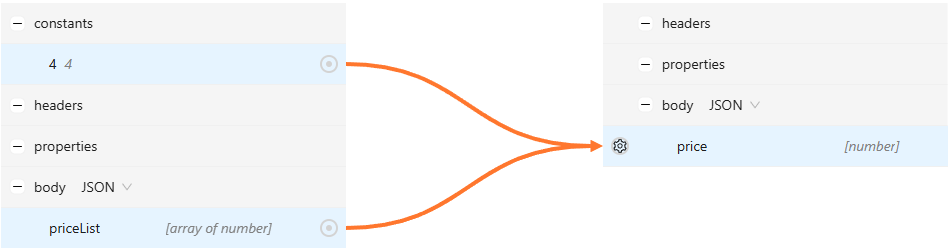

**Expression sample:**
```text
getFirst(
   filterBy(
      body.priceList,
      body.priceList > constant.4
   )
)
```

**Input data:**
```json
{
   "priceList": [
      3,
      1,
      5,
      7
   ]
}
```

**Result:**
```json
{
   "price": 5
}
```

**Example 4: Build map**

Get first object from array, where id = 100, and return only value(s) placed in "values" (value might be an array of primitives).

**Mapper structure sample:**

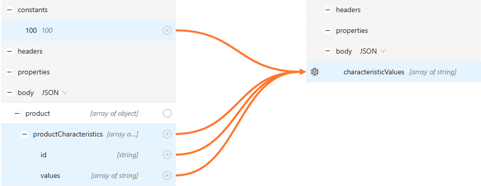

**Expression sample:**
```text
getFirst(body.customers)
   map(filterBy(
      body.product.productCharacteristics,
      body.product.productCharacteristics.id == constant.100
      ),
   body.product.productCharacteristics.values
   )
)
```

**Input data:**
```json
{
   "product": [
      {
         "productCharacteristics": [
            {
               "values": [
                  "Prepaid",
                  "Postpaid"
               ],
               "id": 200
            },
            {
               "values": [
                  "B2C",
                  "B2B"
               ],
               "id": 100
            },
            {
               "values": [
                  "Preorder",
                  "Standalone"
               ],
               "id": 100
            }
         ]
      }
   ]
}
```

**Result:**
```json
{
   "characteristicValues":[
      "B2C",
      "B2B"
   ]
}
```

##### map
Fetch "id" and "type" for each customer object in array and map them together with a separator (e.g. to an array of strings).

**Mapper structure sample:**

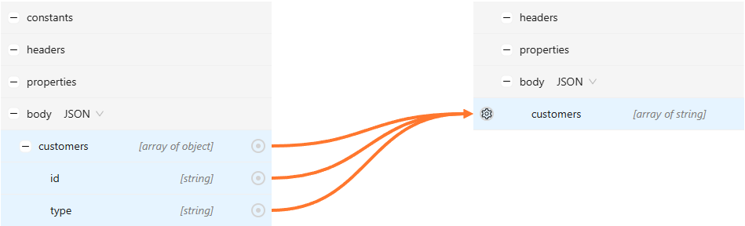

**Expression sample:**
```text
map(
   body.customers,
   body.customers.id + '_' + body.customers.type
)
```

**Input data:**
```json
{
   "customers": [
      {
         "type": "Residential",
         "id": "1234567890"
      },
      {
         "type": "Business",
         "id": "2345678901"
      },
      {
         "type": "Residential",
         "id": "3456789012"
      }
   ]
}
```

**Result:**
```json
{
   "customers":[
      "1234567890_Residential",
      "2345678901_Business",
      "3456789012_Residential"
   ]
}
```

##### sort
Sort array elements in ascending or descending order.

**Example 1: Ascending**

Sort array of customers based on each customer's name in alphabet order.

**Mapper structure sample:**

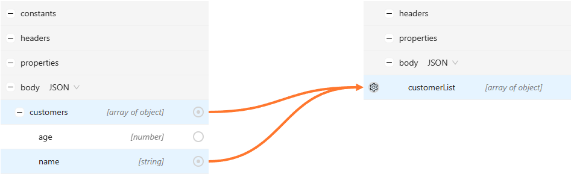

**Expression sample:**
```text
sort(body.customers, body.customers.name)
```

**Input data:**
```json
{
   "customers": [
      {
         "name": "John Smith",
         "age": 32
      },
      {
         "name": "Alan Norman",
         "age": 20
      },
      {
         "name": "Juan Rodriguez",
         "age": 44
      }
   ]
}
```

**Result:**
```json
{
   "customerList": [
      {
         "name": "Alan Norman",
         "age": 20
      },
      {
         "name": "John Smith",
         "age": 32
      },
      {
         "name": "Juan Rodriguez",
         "age": 44
      }
   ]
}
```

**Example 2: Descending**

Sort values in "numbers" array in descending order.

**Mapper structure sample:**

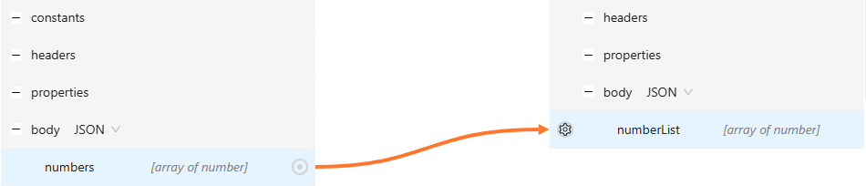

**Expression sample:**
```text
sort(body.numbers, -body.numbers)
```

**Input data:**
```json
{
   "numbers": [
      12,
      3,
      7,
      33
   ]
}
```

**Result:**
```json
{
   "numbers": [
      33,
      12,
      7,
      3
   ]
}
```

##### list
Build list from primitives, objects and arrays.

**Mapper structure sample:**

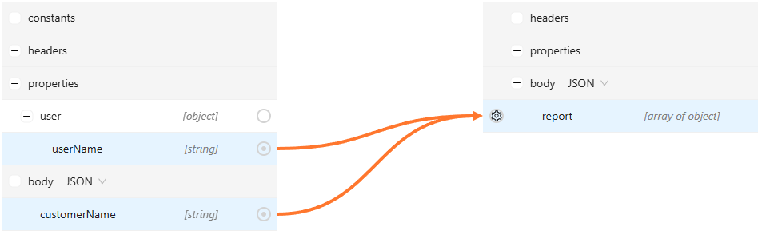

**Expression sample:**
```text
list(
   makeObject('requester', body.customerName),
   makeObject('user', property.user.userName)
)
```

**Input data:**
```json
{
   "customerName": "Stefano Espiga"
}
```

**Result:**
```json
{
   "report": [
      {
         "requester": "Stefano Espiga"
      },
      {
         "user": "system"
      }
   ]
}
```

#### Object

##### getKeys
Pick all field names (keys) from the object.

> **ℹ️Note**: This function cannot be used inside *filterBy*, *sort*, *map* functions.

**Mapper structure sample:**

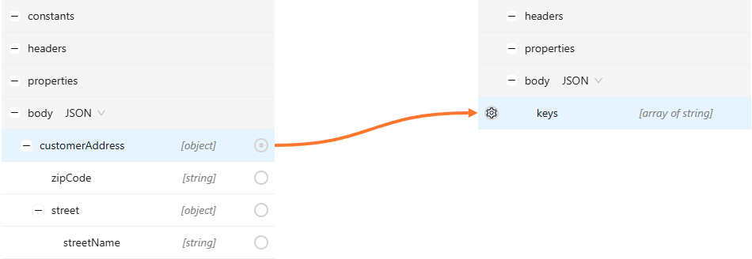

**Expression sample:**
```text
getKeys(body.customerAddress)
```

**Input data:**
```json
{
   "customerAddress":{
      "zipCode": "81647",
      "street": {
         "streetName": "Piramide Drive"
      }
   }
}
```

**Result:**
```json
{
   "keys": [
      "zipCode",
      "street"
   ]
}
```

##### getValues
Pick all field values from the object.

> **ℹ️Note**: This function cannot be used inside *filterBy*, *sort*, *map* functions.
When *getValues* is placed inside *replaceAll* function it will be **only** properly transformed if fields have string data type.

**Mapper structure sample:**

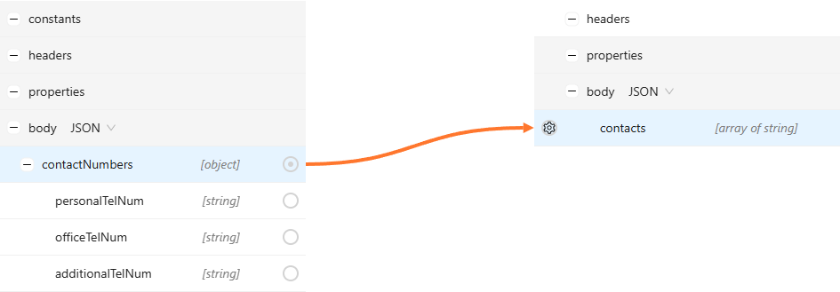

**Expression sample:**
```text
getValues(body.contactNumbers)
```

**Input data:**
```json
{
   "contactNumbers":{
       "personalTelNum": "(***) ***-0886",
       "officeTelNum": "(***) ***-3651",
       "additionalTelNum": "(***) ***-3228"
    }
}
```

**Result:**
```json
{
   "contacts": [
      "(***) ***-0886",
      "(***) ***-3651",
      "(***) ***-3228"
   ]
}
```

##### makeObject
Build key/value map from primitives and objects.

**Mapper structure sample:**

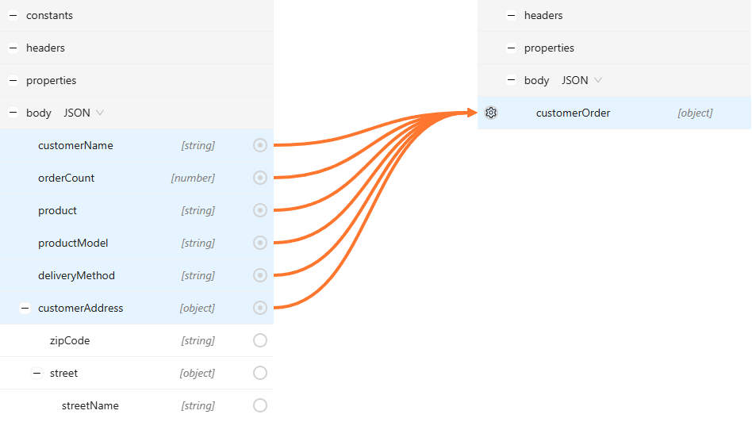

**Expression sample:**
```text
makeObject(
   body.customerName, body.orderCount,
   body.product, body.productModel,
   body.deliveryMethod, body.customerAddress
)
```

**Input data:**
```json
{
   "customerName": "John Smith",
   "orderCount": 10,
   "product": "mobile",
   "productModel": "Samsung Galaxy",
   "deliveryMethod":"Store",
   "customerAddress":{
      "zipCode":"81647",
      "street":{
         "streetName":"Piramide Drive"
      }
   }
}
```

**Result:**
```json
{
   "customerOrder": {
      "John Smith": 10,
      "mobile": "Samsung Galaxy",
      "Store": {
         "zipCode": "81647",
         "street": {
            "streetName": "Piramide Drive"
         }
      }
   }
}
```

##### mergeObjects
Merge objects or array of objects to a new object.

> **ℹ️Note**: Pay attention to the fields with identical names - the resulted structure will only contain a single field with the value that was populated last.

**Mapper structure sample:**

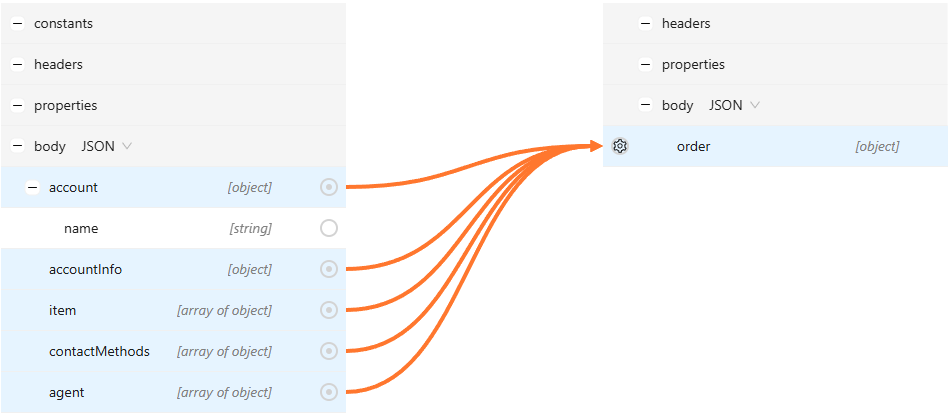

**Expression sample:**
```text
mergeObjects(
   body.account,
   body.accountInfo,
   filterBy(body.item, true),  -- every object from array will be fetched
   getFirst(body.contactMethods),
   body.agent,
   makeObject('storeId', '1000008') -- where 'storeId' is a key and '1000008' is a value
)
```

**Input data:**
```json
{
   "account": {
      "name": "John Smith"
   },
   "accountInfo": {
      "language": "eng"
   },
   "item": [
      {
         "itemName": "Apple IPhone 14"
      },
      {
         "type": "Mobile Phone"
      }
   ],
   "contactMethods": [
      {
         "id": "6e81f49c-ba58-495b-bada-eda6b4d9afd4"
      },
      {
         "id": "916361c5-795c-44a5-a1e8-cad07dbec4b6"
      }
   ],
    "agent": [
      {
         "agentName": "Raul Gonzalez"
      },
      {
         "position": "Manager"
      }
   ]
}
```

**Result:**
```json
{
   "order": {
      "name": "John Smith",
      "language": "eng",
      "itemName": "Apple IPhone 14",
      "type": "Mobile Phone",
      "id": "6e81f49c-ba58-495b-bada-eda6b4d9afd4",
      "agentName": "Raul Gonzalez",
      "position": "Manager",
      "storeId": "1000008"
   }
}
```

#### Date / Time

##### formatDateTime
Build datetime from connected source fields and/or constants.

> **ℹ️Note**: This function requires at least two arguments specified, one of them must be format.

**Example 1: Basic usage**

Build datetime with format 'yyyy-MM-dd' from three connected source body fields.

**Mapper structure sample:**

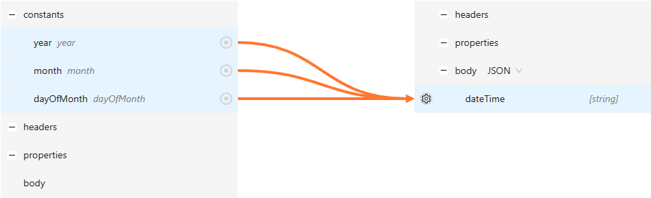

**Expression sample:**
```text
formatDateTime(
   'yyyy-MM-dd',
   constant.year,
   constant.month,
   constant.dayOfMonth
)
```

**Input data:**
```text
No body
```

**Result:**
```json
{
   "dateTime": "2024-05-27"
}
```

**Example 2: With constants**

Build complex datetime with format 'yyyy-MM-dd HH:mm:ss.SSSZ' from three connected source body fields and constants.

**Mapper structure sample:**


**Expression sample:**
```text
formatDateTime(
   'yyyy-MM-dd HH:mm:ss.SSSZ',
   constant.year,
   constant.month,
   constant.dayOfMonth,
   17, -- hours
   11, -- minutes
   12, -- seconds
   532, -- milliseconds
   'Europe/Moscow', -- timezone
   'ru' -- locale
)
```

**Input data:**
```text
No body
```

**Result:**
```json
{
   "dateTime": "2024-05-27 17:11:12.532+0300"
}
```

**Example 3: With null values**

Build complex datetime with format 'yyyy-MM-dd HH:mm:ss.SSSZ' but skip hours, minutes, seconds and milliseconds.

**Mapper structure sample:**


**Expression sample:**
```text
formatDateTime(
   'yyyy-MM-dd HH:mm:ss.SSSZ',
   constant.year,
   constant.month,
   constant.dayOfMonth,
   null, -- hours
   null, -- minutes
   null, -- seconds
   null, -- milliseconds
   'Europe/Moscow', -- timezone
   'ru' -- locale
)
```

**Input data:**
```text
No body
```

**Result:**
```json
{
   "dateTime": "2024-05-27 00:00:00.000+0300"
}
```

### Dictionary

This option allows to configure a dictionary, that could match retrieved value with another value from the dictionary and use its translation instead of the source value.
User is able to work with dictionary configuration via table view with buttons "**Add rule**", "**Clear rules**" and switch to the code view.
Value specified in "**Default**" field will be used when input value has no matches in the dictionary.
Inability to find proper match while having empty "**Default**" field leads to error.

#### Replace value with matching value, specified in dictionary

**Mapper structure sample:**

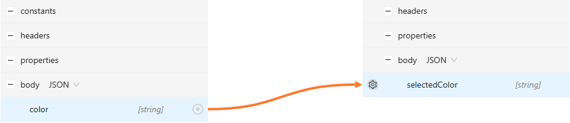

**Transformation sample:**
```text
R = Red
B = Blue
```

**Input data:**
```json
{
   "color": "R"
}
```

**Result:**
```json
{
   "selectedColor": "Red"
}
```

### Format date/time

This transformation type is intended to convert source date to the desirable format. Next details could be specified for input output:
- Checkbox "**Unix epoch**" - if checked, date is going to be handled by Unix format.
- **Format** - specifies the format of date/datetime (e.g., dd-MM-yyyy). Not available for Unix format. If output format requires time, time zone and locale, but they are either missing in the request or settings, system will pick default values as "00:00:00", "UTC" and "en_US" respectively.
- **Locale** - specifies locale (e.g., en_US). Not available for Unix format.
- **Timezone** - specifies timezone (e.g., GMT). Not available for Unix format.

#### Convert source data from 'yyyy-MM-dd HH:mm:ss.SSSZ' to Unix format

**Mapper structure sample:**


**Transformation sample:**
```text
Input:
Format: yyyy-MM-dd HH:mm:ss.SSSZ
Locale: en_US
Time zone: GMT

Output:
Unix epoch
```

**Input data:**
```json
{
   "dateTime": "2024-05-27 17:11:12.532+0400"
}
```

**Result:**
```json
{
   "orderDateTime": "1716815472"
}
```

### Conditional Transformation

Via this option it is possible to add a condition and true/false values. Available fields:
- **Condition** - Mandatory field. Specifies a condition itself.
- **True expression** - Mandatory field. Specifies the value, when condition is fulfilled (true).
- **False expression** - Mandatory field. Specifies the value, when condition is not fulfilled (false).

Every value shall be specified by using an expression, written in custom AtlasMap syntax.

#### Return "1" if primitive has "Completed" status, otherwise "0"

**Mapper structure sample:**

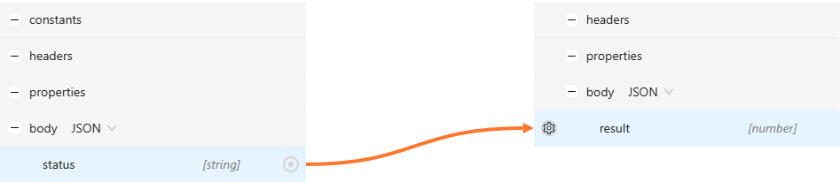

**Transformation sample:**
```text
Condition: body.status == 'Completed'
True expression: 1
False expression: 0
```

**Input data:**
```json
{
   "status": "Completed"
}
```

**Result:**
```json
{
   "result": 1
}
```

#### Return "missing" if object is null, otherwise use the value from request

**Mapper structure sample:**


**Transformation sample:**
```text
Condition: body.customer == null
True expression: 'missing'
False expression: body.customer
```

**Input data:**
```json
{
   "customer": {
      "id": "d532bf5b-09d3-4ee5-81db-90905fd4f59e",
      "name": "Raul Gonzalez"
   }
}
```

**Result:**
```json
{
   "newCustomer": {
      "id": "d532bf5b-09d3-4ee5-81db-90905fd4f59e",
      "name": "Raul Gonzalez"
   }
}
```

### Default value

This option allows to specify a default value for the mapped parameter when its value is null, empty or whole parameter is missing in the request. Source parameter, participating in the transformation, must not have a default value in a scheme, otherwise logic won't be fulfilled.

#### Set default value for primitive when parameter is missing in the request

**Mapper structure sample:**

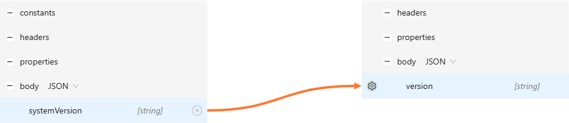

**Transformation sample:**
```text
Value: 2024_3
```

**Input data:**
```text
No body
```

**Result:**
```json
{
   "version": "2024_3"
}
```

### Replace all

This option allows to edit entered value, by replacing its part, utilizing regular expressions. Next fields are available on the window, when "Replace all" transformation is selected:

- **Regular expression** - field that accepts regular expressions to find the part for replacement.
- **Replacement** - field that contains the data that shall be placed instead.

#### Capture each separate word to circle brackets

**Mapper structure sample:**

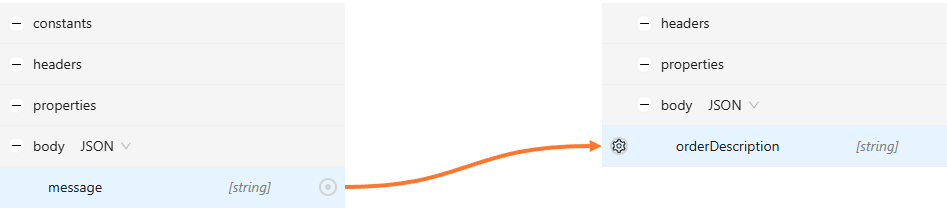

**Transformation sample:**
```text
Regular expression: (\w[\w\d]*)
Replacement: ($1)
```

**Input data:**
```json
{
   "message": "You order has been created successfully"
}
```

**Result:**
```json
{
   "orderDescription": "(You) (order) (has) (been) (created) (successfully)"
}
```

#### Replace commas with dots between digits

**Mapper structure sample:**

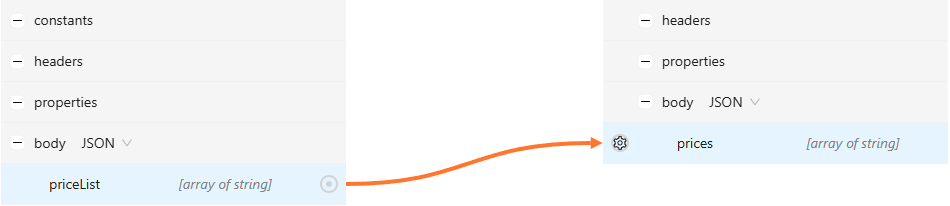

**Transformation sample:**
```text
Regular expression: (?<=\d)\,(?=\d)
Replacement: .
```

**Input data:**
```json
{
   "priceList": [
      "12,5",
      "10",
      "9,25",
      "18,75"
   ]
}
```

**Result:**
```json
{
   "prices": [
      "12.5",
      "10",
      "9.25",
      "18.75"
   ]
}
```

### Trim

This option allows to strip spaces in the given string. Field "**Side**" additionally sets the target of trim operation: Left, Right, Both.

#### Trim leading and trailing spaces from the string

**Mapper structure sample:**

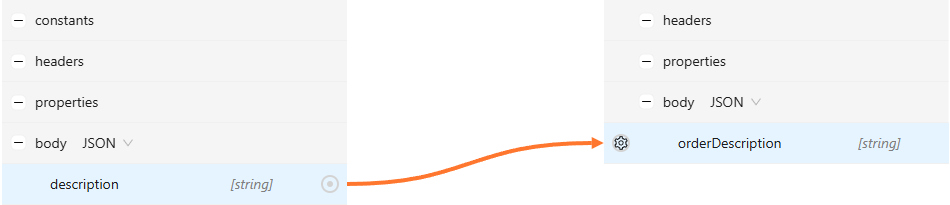

**Transformation sample:**
```text
Side: Right
```

**Input data:**
```json
{
   "description": "Insurance is not required      "
}
```

**Result:**
```json
{
   "orderDescription": "Insurance is not required"
}
```
