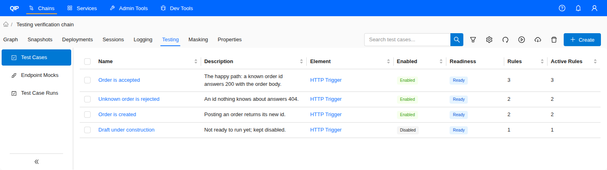
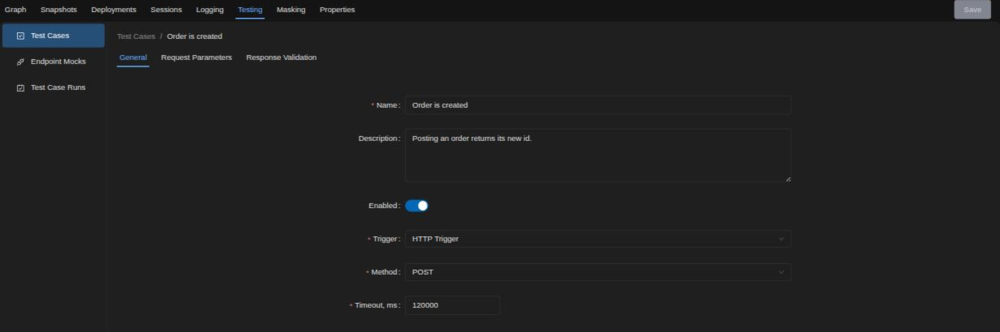
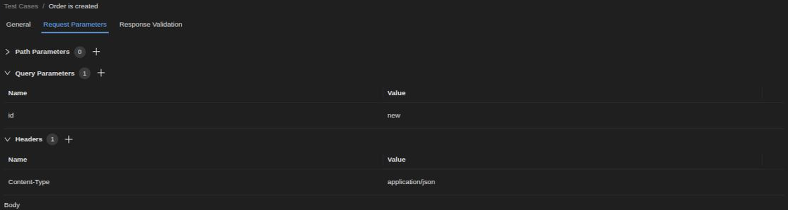
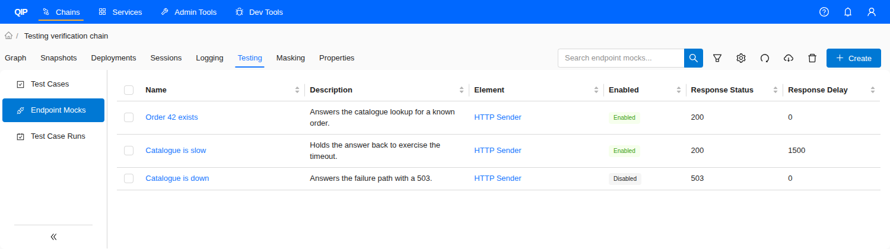
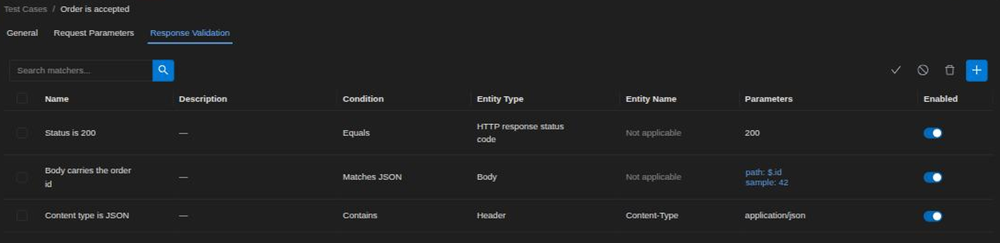
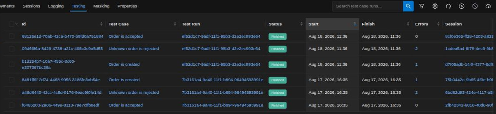
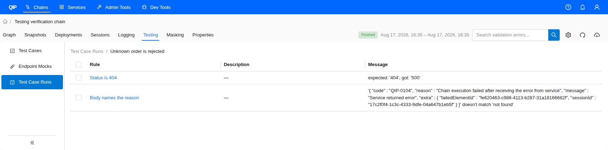

# Testing

> ⛔️ This functionality is not available via the VS Code Extension.

## Description

---
The **Testing** tab collects everything needed to exercise a single chain without the systems around it. It holds three sections:

- **Test Cases** - a test case calls one of the chain's [HTTP Trigger](../1__Graph/1__Elements_Library/6__Triggers/1__HTTP_Trigger/http_trigger.md) elements with a prepared request and checks the response against a list of rules. Every rule that does not hold is recorded as a validation error.
- **Endpoint Mocks** - an endpoint mock answers on behalf of an outbound HTTP call the chain makes, so the chain can be exercised while the real endpoint is unavailable or would produce side effects.
- **Test Case Runs** - the history of the chain's test case executions, with their statuses, timings, validation errors and the sessions they produced.

Test cases and endpoint mocks are handled by a separate testing service, which reads the chain configuration from the runtime catalog and calls the deployed chain through the engine. The chain therefore has to be [deployed](../3__Deployments/deployments.md) before a test case can run, and the trigger a test case points at has to be an **HTTP Trigger** with a configured context path - no other trigger type can be activated.

> ℹ️ **Note:** The **Testing** tab appears only where the testing service is deployed, reachable and reporting a non-production mode. Non-production mode is opt-in: a testing service that is not configured for it reports production, so a freshly deployed service leaves the tab hidden until an operator switches the mode. On a production installation the tab is hidden, the **Testing** group under [Admin Tools](../../03__Admin_Tools/9__Testing/testing.md) is hidden with it, and a direct link to a testing address lands on the "not found" page. Testing is a development and verification feature; it is not intended for production installations.

## User Interface

---
Open a chain and click the **Testing** tab. A vertical menu on the left switches between **Test Cases**, **Endpoint Mocks** and **Test Case Runs**. Everything shown here is limited to the current chain. The same entities across all chains, together with the test runs that group them, are available under [Admin Tools](../../03__Admin_Tools/9__Testing/testing.md).

### Test Cases Table View

The table lists the test cases of the chain. The following columns are available:

- **Name** - test case name, a clickable reference to the test case editor.
- **Description** - user description of the test case.
- **Element** - the **HTTP Trigger** the test case calls, a clickable reference to the element in the chain [graph](../1__Graph/graph.md).
- **Enabled** - **_Enabled_** or **_Disabled_**. A disabled test case is still queued when it is run, but its case run finishes with the status **_Skipped_** instead of calling the chain.
- **Readiness** - **_Ready_** when the test case has a trigger, request settings and at least one enabled response validation rule, **_Incomplete_** otherwise. The column is computed in the browser for information only; an incomplete test case can still be run.
- **Rules** - the number of response validation rules on the test case.
- **Active Rules** - the number of those rules that are enabled. A disabled rule is not evaluated.
- **Created At**, **Created By**, **Updated At**, **Updated By** - audit fields, hidden by default and enabled through the column settings.

**Control panel**

- **Search field** - narrows the list to the rows whose text matches. Like **Filter**, the search is applied by the service, so it also covers rows that are not loaded yet.
- **Filter** - opens the filter pop-up. Filters are applied by the service, so they also cover rows that are not loaded yet.
- **Column settings** - opens the pop-up that adjusts visibility and order of the columns. The selection survives a page reload.
- **Refresh** - reloads the table.
- **Run selected test cases** - starts a test run over the checked test cases.
- **Export selected test cases** - downloads the checked test cases as an archive.
- **Delete selected test cases** - deletes the checked test cases after a confirmation.
- **Create a test case** - opens the creation dialog.

Click a column header to sort the table by that column, and drag the edge of a header to resize it. Sorting is applied by the service, so it orders the whole list rather than the loaded rows. **Readiness** is the one column that cannot be sorted on: the service does not store it, so it has nothing to sort by.

Rows are loaded page by page as the table is scrolled. When some rows are still unloaded, the selection menu offers **Select all that match the filters**: bulk actions then resolve their targets on the server under the current filters and search text rather than from the loaded rows, and the confirmation says so. Changing a filter, the search text or the sort clears the selection, because the rows it was made over are no longer the rows the list holds.

Click anywhere in a row except a link cell to open the **Test Case Details** side panel, which repeats the fields above in read-only form. The link cells navigate instead: **Name** opens the test case editor and **Element** opens the element in the chain graph.

> ℹ️ **Note:** Importing test cases is available only from the cross-chain list under [Admin Tools](../../03__Admin_Tools/9__Testing/testing.md); creating one is available only here, because a new test case needs a chain to pick its trigger from.

### Create a Test Case
Click **Create a test case** and fill in the dialog:

- **Name** - mandatory name of the test case.
- **Trigger** - the **HTTP Trigger** to call. Only `http-trigger` elements of the chain are offered, including elements nested in containers.
- **Description** - optional description.

The new test case is created with **Enabled** off, a timeout of 120000 ms, the first method the selected trigger accepts and no validation rules, and the editor opens on it right away.

### Test Case Editor

The editor has three tabs and a **Save** button in the chain header, beside the chain tabs, where the **Apply** button of the [Logging](../5__Logging/logging.md) and [Properties](../7__Properties/properties.md) tabs sits. **Save** stays disabled until something has changed and the test case is valid: it needs a name, a chain, a trigger element, an HTTP method and valid validation rules. Saving keeps the editor open. Leaving it with unsaved changes raises a confirmation; switching between the editor's own tabs does not.

#### General Tab
Names the test case and the call it makes:

- **Name** - mandatory test case name.
- **Description** - free-text description.
- **Enabled** - switch. A disabled test case is skipped when it is run.
- **Trigger** - mandatory, the **HTTP Trigger** to call.
- **Method** - mandatory HTTP method. The list comes from the trigger's own method restriction and falls back to `GET` when the trigger restricts nothing.
- **Timeout, ms** - how long the testing service waits for the chain to answer.

#### Request Parameters Tab

Defines what the request carries. Each set of pairs is a section that opens when the test case has something in it and stays closed when it is empty, with the number of pairs beside its name:

- **Path Parameters** - name and value pairs substituted into the `{name}` placeholders of the trigger path.
- **Query Parameters** - name and value pairs appended to the request as a query string.
- **Headers** - name and value pairs sent as request headers.
- **Body** - request body, edited as JSON.

#### Response Validation Tab
Holds the rules the response is checked against - see [Validation Rules and Request Matchers](#validation-rules-and-request-matchers). A response rule can inspect the response **Body**, the **HTTP response status code** or a **Header**.

### Endpoint Mocks Table View

The table lists the endpoint mocks of the chain. **Name**, **Description**, **Enabled** and the audit fields repeat the test case ones. Three more columns:

- **Element** - the element whose outgoing call the mock answers, a clickable reference to the chain [graph](../1__Graph/graph.md). The test case table carries this column too, where it points at the trigger instead.
- **Response Status** - the HTTP status code the mock returns.
- **Response Delay** - how long, in milliseconds, the mock holds the answer back.

**Readiness**, **Rules** and **Active Rules** have no place here: a mock has no readiness, and the counts of its request matchers are shown in the **Endpoint Mock Details** side panel instead. Every column of this table can be sorted on.

The control panel offers **Search**, **Filter**, **Column settings**, **Refresh**, **Export selected endpoint mocks**, **Delete selected endpoint mocks** and **Create an endpoint mock**. There is no run action: a mock is exercised by the test case whose chain reaches it. Clicking a row opens the **Endpoint Mock Details** side panel.

### Create an Endpoint Mock
Click **Create an endpoint mock** and fill in the dialog:

- **Name** - mandatory name of the mock.
- **Endpoint** - the element to answer for. Only [HTTP Sender](../1__Graph/1__Elements_Library/7__Senders/4__HTTP_Sender/http_sender.md) elements and [Service Call](../1__Graph/1__Elements_Library/7__Senders/6__Service_Call/service_call.md) elements whose operation protocol is HTTP are offered, including elements nested in containers.
- **Description** - optional description.

The new mock is created **Enabled**, with status code `200` and no delay. These defaults are the opposite of the test case ones: a mock starts working the moment it is saved, while a test case has to be enabled first.

### Endpoint Mock Editor
Three tabs, the same **Save** button in the chain header, and the same unsaved-changes confirmation. **Save** needs a name, a chain, an endpoint element and valid request matchers - no method, because a mock answers whatever method the endpoint is called with.

#### General Tab
Names the mock and the endpoint it answers for:

- **Name** - mandatory mock name.
- **Description** - free-text description.
- **Enabled** - switch. Only enabled mocks take part in matching.
- **Endpoint** - mandatory, the element whose call the mock answers.
- **Status Code** - mandatory, between `100` and `599`. A stored value outside that range is answered as `200`.
- **Delay, ms** - mandatory, how long the answer is held back, measured from the moment the call arrives. The service caps the wait at one minute.

#### Response Parameters Tab
Defines what the mock answers with:

- **Headers** - name and value pairs returned with the response. The section opens when the mock has headers and stays closed when it has none. A header name that is not a valid HTTP field name, or a value carrying a control character, is refused as it is typed.
- **Body** - response body, edited as JSON.

#### Request Matchers Tab
Holds the rules that decide whether the mock answers a given call - see [Validation Rules and Request Matchers](#validation-rules-and-request-matchers). A request matcher can inspect the request **Body**, a **Header**, a **Path parameter** or a **Query parameter**.

### Validation Rules and Request Matchers

Both editors use the same table. A row is one rule, and it has the following columns:

- **Name** - mandatory rule name, edited in place.
- **Description** - optional description, edited in place and expandable when long.
- **Condition** - what the rule checks. See the table below.
- **Entity Type** - the part of the message the rule reads. Request matchers offer **Body**, **Header**, **Path parameter** and **Query parameter**; response validation rules offer **Body**, **HTTP response status code** and **Header**.
- **Entity Name** - the header or parameter name. Mandatory for **Header**, **Path parameter** and **Query parameter**, and **_Not applicable_** for the rest.
- **Parameters** - the values the condition needs, which differ per condition.
- **Enabled** - only enabled rules are evaluated.

The toolbar above the table adds a rule, deletes the checked rules, and enables or disables them in bulk. A local search filters the rows already in the table; typing in it clears the checked rows, so a bulk action never reaches a row the search has hidden.

> ℹ️ **Note:** The in-place edited cells - **Name** and **Description** here, and the same cells wherever else the product edits in place - commit on **Enter** only. Clicking away closes the cell and discards what was typed.

Conditions and the parameters they take:

| Condition | Parameters | Description |
|---|---|---|
| **Empty** | none | the value is empty |
| **Exists** | none | the value is present |
| **Equals** | value | the value equals the parameter. For **HTTP response status code** the parameter is picked from a list of status codes |
| **Contains** | value | the value contains the parameter |
| **Matches pattern** | pattern | the value matches the regular expression |
| **Starts with** | value | the value starts with the parameter |
| **Ends with** | value | the value ends with the parameter |
| **Matches JSON Schema** | path, schema | the JSON at the given path validates against the schema |
| **Matches JSON** | path, sample | the JSON at the given path matches the sample |

The last two open a dedicated editor with a **Path** field, holding a JSON path and defaulting to `$`, and a code editor for the schema or the sample.

Changing the **Condition** of a rule clears its parameters, because the parameters of one condition never fit another. Changing the **Entity Type** to one that needs no name clears the entity name. A rule that is missing a name, an entity name or a parameter is marked in the table, and the editor's **Save** stays disabled until it is completed.

> ℹ️ **Note:** A rule that cannot be evaluated at run time does not stop the work around it. A mock carrying such a rule is passed over, and the call falls through to the next mock; a broken response validation rule is recorded as a validation error and the test case run still finishes.

### Run Test Cases
Select test cases in the table and click **Run selected test cases**. The service creates a **test run** over them and reports it with a notification naming the run identifier. The notification links to the run only when the cases were started from the cross-chain list under [Admin Tools](../../03__Admin_Tools/9__Testing/testing.md), because that is where the runs list lives and chain rights alone do not open it.

While the run proceeds:

1. Each test case in the run is turned into a test case run and executed in order. Test cases inside a single run execute **sequentially**, one at a time.
2. A disabled test case is not called; its case run finishes with the status **_Skipped_**.
3. For an enabled test case, the testing service calls the chain's **HTTP Trigger** with the request configured on the **General** and **Request Parameters** tabs, and links the resulting chain [session](../4__Sessions/sessions.md) to the case run. The call goes to the engine the chain is deployed to, so a chain on a micro-engine domain is tested on that domain. A chain deployed to more than one domain is tested on one of them, which the testing service records in its log.
4. The response is checked against every enabled response validation rule. Each rule that does not hold is stored as a validation error against the case run, and the case run still reaches **_Finished_**.

Separate test runs execute **in parallel**, so several runs can progress at the same time. Test runs themselves are managed under [Admin Tools](../../03__Admin_Tools/9__Testing/testing.md).

### Test Case Runs Table View

The table lists the case runs of the chain, sorted by start time descending. The following columns are available:

- **Id** - identifier of the case run, a clickable reference to its validation errors.
- **Test Case** - name of the test case that was run, a clickable reference to its editor.
- **Test Run** - the run this case run belongs to, a clickable reference to it.
- **Status** - execution status. Possible values:
  - ⚫ **_Pending_** - queued and waiting for a worker.
  - 🔵 **_Running_** - the chain has been called and the answer is awaited.
  - 🟢 **_Finished_** - the case run completed. It may still carry validation errors.
  - ⚫ **_Skipped_** - the test case is disabled, so the chain was not called.
  - 🟡 **_Canceled_** - the case run was canceled before it started.
- **Start** - start datetime of the case run.
- **Finish** - finish datetime of the case run.
- **Errors** - number of validation errors recorded. A count above zero is a clickable reference to them; a zero is plain text, since the errors page would open empty.
- **Session** - the chain session the case run produced, a clickable reference to the [session](../4__Sessions/sessions.md). When no session can be resolved, the identifier is shown as plain text.

**Test Run** and **Session** cannot be sorted on; every other column can.

**Control panel**

- **Refresh**, **Search**, **Filter** and **Column settings**, as on the other tables.
- **Restart selected test case runs** - creates a new test run over the same test cases.
- **Cancel selected test case runs** - cancels the checked case runs. The button is offered only while a checked case run is still queued, since that is the only state the service cancels.
- **Export selected test case runs** - downloads the checked case runs as a CSV file.

Case runs cannot be deleted on their own; they are removed with the test run that holds them.

> ℹ️ **Note:** Canceling reaches only the case runs that have not started yet. A case run already in **_Running_** keeps running, and the confirmation says so.

Clicking a row opens the **Test Case Run Details** side panel.

### Validation Errors

Click the **Id** of a case run, or an **Errors** count above zero, to open the validation errors of that case run. The table lists one row per rule that did not hold:

- **Rule** - name of the rule, a clickable reference to the test case it belongs to. When the rule has since been deleted, its identifier is shown instead.
- **Description** - description of the rule.
- **Message** - what the check reported, for example the expected and the actual value.

The toolbar offers **Refresh**, **Column settings**, a local search and **Export selected validation errors**.

Failures outside the rules are recorded here as well - a test case with no trigger reference, a trigger that cannot be resolved or activated, or a test case that no longer exists. Such a row carries the message but no rule.

## Permissions

---
Everything on the **Testing** tab is gated by the rights of the chain it belongs to. The same screens under [Admin Tools](../../03__Admin_Tools/9__Testing/testing.md) ask for the matching **Admin Tools** rights instead:

| Action | Right on the chain tab | Right under Admin Tools |
|---|---|---|
| Open a list, a details panel or an editor, and **Refresh** | `read` | `read` |
| **Create**, **Delete**, and saving an editor | `update` | `update` |
| **Run**, **Restart**, **Cancel** | `execute` | `execute` |
| **Import** | `import` | `import` |
| **Export** | `export` | `export` |

The two sets are independent: holding one grants nothing under the other. Full rights on a chain leave the cross-chain lists closed, and the **Test Run** reference in the **Test Case Runs** table above leads to a page that only **Admin Tools** `read` opens.

## Endpoint Mocking

---
Endpoint mocking is a feature of the **engine**, not of the chain: it is switched on for a whole engine installation, and it then applies to every chain deployed there.

When it is on, the HTTP client the engine builds for a chain element is repointed at the testing service. An outbound call therefore never leaves for its real host. Instead, it arrives at the testing service carrying the chain identifier, the element identifier, the request path and the operation path of the element it came from, along with the original headers and body. The testing service then:

1. selects the **enabled** mocks bound to that chain and that element;
2. orders them most specific first - the mock with the most enabled request matchers wins, and among equals the oldest one;
3. answers with the first mock whose enabled request matchers all pass, honoring its status code, headers, body and delay.

**An element with no matching mock receives `404`.** This is the defined behavior, not a defect: the engine has no fallback, so it never reaches the real endpoint. A chain element that must reach a live system while mocking is on therefore needs a mock that matches its calls.

Calls that are intercepted:

- [HTTP Sender](../1__Graph/1__Elements_Library/7__Senders/4__HTTP_Sender/http_sender.md);
- [GraphQL Sender](../1__Graph/1__Elements_Library/7__Senders/7__GraphQL_Sender/graphql_sender.md);
- [Service Call](../1__Graph/1__Elements_Library/7__Senders/6__Service_Call/service_call.md) over HTTP or GraphQL.

A Service Call over Kafka, AMQP or gRPC is never intercepted, and neither is an **HTTP Trigger**, which receives calls rather than making them.

> ℹ️ **Note:** A mock can be created only for an **HTTP Sender** or for a **Service Call** over HTTP. A **GraphQL Sender**, and a **Service Call** over GraphQL, are still intercepted while mocking is on, and since no mock can be bound to them, their calls are answered `404`.

The two settings live on the engine:

| Setting | Environment variable | Default | Description |
|---|---|---|---|
| `qip.testing.enabled` | `TESTING_SERVICE_ENABLED` | `false` | switches endpoint mocking on for the engine |
| `qip.testing.address` | `TESTING_SERVICE_ADDRESS` | `http://testing-service:8080` | address of the testing service the calls are sent to |

A change takes effect when the engine restarts. No chain has to be redeployed.

> ℹ️ **Note:** Whatever the element sends, the testing service receives - authorization headers, API keys, cookies and secrets in the query string included. Enable mocking only where the testing service is trusted with that traffic.

## Constraints

---

- Only an **HTTP Trigger** can be activated by a test case. A trigger of any other type cannot be tested this way.
- Test cases and endpoint mocks are not part of the chain export. They are exported and imported from their own tables.
- Mocking is off by default, and it is environment-wide. With mocking on and the testing service absent, every outbound HTTP call of every chain fails to connect; with the service present, every call without a matching mock is answered `404`. Switch it on only on an installation someone is testing on.
- An in-place edited cell commits on **Enter** only; clicking away discards the edit.
