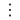

# Chains
## Description

---
Chain is an integration configuration that consists of Apache Camel (or customized) modules. Each chain is intended to perform a particular integration task.
A chain can be triggered by any external consumer, so chain configuration starts with a trigger (HTTP Trigger, MCP Trigger, Kafka Trigger, etc.).
When the chain configuration is complete, it should be deployed on at least one [Engine Domain](../03__Admin_Tools/1__Domains/domains.md) (otherwise, the chain cannot be triggered).

## User Interface

---
### Chains and Folders View
<ins>Web UI</ins>

The screen shows a table of chains (marked with icon ) and chain folders (marked with icon ). To see all the chains and folders under a particular folder, click the  icon next to the folder name. The following control elements are available at the top of the table:
- **Search field** - search box, provides ability to find respective data in the table. To find a particular chain/folder by a specific feature (case-insensitive) use the search field at the top of the screen with the text "Full text search" and a lens icon . Full-text search is applicable by the following data:
  - Chain fields:
    - Chain name
    - Chain ID
    - Chain description
  - Chain elements in [graph](1__Graph/graph.md):
    - Path ([HTTP Trigger](1__Graph/1__Elements_Library/6__Triggers/1__HTTP_Trigger/http_trigger.md), [Service Call](1__Graph/1__Elements_Library/7__Senders/6__Service_Call/service_call.md))
    - Method ([HTTP Trigger](1__Graph/1__Elements_Library/6__Triggers/1__HTTP_Trigger/http_trigger.md), [Service Call](1__Graph/1__Elements_Library/7__Senders/6__Service_Call/service_call.md))
    - Identifier ([MCP Trigger](1__Graph/1__Elements_Library/6__Triggers/10__MCP_Trigger/mcp_trigger.md))
    - Topic ([Kafka Trigger](1__Graph/1__Elements_Library/6__Triggers/8__Kafka_Trigger/kafka_trigger.md), [Kafka Sender](1__Graph/1__Elements_Library/7__Senders/2__Kafka_Sender/kafka_sender.md),
    [AsyncAPI Trigger](1__Graph/1__Elements_Library/6__Triggers/3__AsyncAPI_Trigger/asyncapi_trigger.md), [Service Call](1__Graph/1__Elements_Library/7__Senders/6__Service_Call/service_call.md))
    - Exchange ([RabbitMQ Trigger](1__Graph/1__Elements_Library/6__Triggers/6__RabbitMQ_Trigger/rabbitmq_trigger.md), [RabbitMQ Sender](1__Graph/1__Elements_Library/7__Senders/1__RabbitMQ_Sender/rabbitmq_sender.md),
    [AsyncAPI Trigger](1__Graph/1__Elements_Library/6__Triggers/3__AsyncAPI_Trigger/asyncapi_trigger.md), [Service Call](1__Graph/1__Elements_Library/7__Senders/6__Service_Call/service_call.md))
    - Queue ([RabbitMQ Trigger](1__Graph/1__Elements_Library/6__Triggers/6__RabbitMQ_Trigger/rabbitmq_trigger.md), [RabbitMQ Sender](1__Graph/1__Elements_Library/7__Senders/1__RabbitMQ_Sender/rabbitmq_sender.md),
    [AsyncAPI Trigger](1__Graph/1__Elements_Library/6__Triggers/3__AsyncAPI_Trigger/asyncapi_trigger.md), [Service Call](1__Graph/1__Elements_Library/7__Senders/6__Service_Call/service_call.md))
  - Folder name - if search query matches, all content (chains and child folders) under the folder will be shown.
-  - opens filter pop-up.
-  - opens pop-up with table properties that allows adjusting visibility and order of the columns except **Name**.
-  - compares selected chains.
-  - pastes chain/folder.
-  - opens pop-up for chains redeploy.
-  - exports the chain(s).
-  - opens a pop-up for chain import. As part of the upload/import operation, the user can additionally select an option to create a snapshot for the imported chain or even deploy it to the selected engine as soon as the import is successfully completed.
-  - deletes selected chains or folders.

Each **chain** contains the following parameters in the table:
- **Name** - chain name, which is clickable reference to the chain [graph](1__Graph/graph.md).
- **Description** - user description of the chain.
- **Status** - shows chain's deployment status. Possible values:
  - ⚫ **_Draft_** - default chain status, that indicates that chain is not deployed yet.
  - 🔵 **_Progressing_** - chain deployment is in progress on one or multiple engines. If status stays for long period of time, it may indicate that system awaits crucial data, specified within a chain (e.g. classifiers in MaaS).
  - 🔴 **_Failed_** - chain deployment failed on one or multiple engines.
  - 🟢 **_Deployed_** - chain is successfully deployed on all requested engines.
- **Labels** - list of colored chain labels, unique within particular chain. It might contain **custom** labels, entered on the chain by user on the <ins>Web UI</ins> or **technical** labels, populated as part of the deployment via Samples Repository. **Technical** labels cannot be updated manually.
- **Modified At** - date of last chain modification.
- **Modified By** - name of the user who modified the chain last.
- **Actions menu** - list of operations accessed via the menu icon :
  - **_Copy link_** - copies chain link to clipboard.
  - _**Edit**_ - opens pop-up to update chain name, description, **custom** labels and additional data, required for DDS generation.
  - _**Export**_ - exports chain from QIP.
  - _**Generate DDS**_ - generates integration design document, based on the chain data.
  - _**Cut**_ - cuts the chain. To paste it, click "paste"  button, available on top of the screen.
  - _**Copy**_ - copies chain (whole object). To paste copied chain, click "paste"  button, available on top of the screen.
  - _**Duplicate**_ - duplicates chain. New chain will be duplicated with the  **"- copy"** postfix.
  - _**Delete**_ - deletes chain.

Each **folder** contains the following parameters in the table:
- **Name** - clickable reference to the page with folder content.
- **Actions menu** - list of operations accessed via the menu icon :
  - **_Create New Folder_** - opens pop-up to add new folder under this one.
  - **_Create New Chain_** - opens pop-up to create chain under the folder.
  - **_Expand All_** - expands all folders (regardless of the nesting level) under the current one.
  - **_Collapse All_** - collapses all child folders and the current one.
  - **_Copy link_** - copies folder link to clipboard. Following the link, you will open the same "**Chains**" page with expanded and highlighted folder.
  - **_Edit_** - opens pop-up to update the folder name.
  - **_Export_** - exports all the chains under the folder.
  - **_Cut_** - cuts the chain folder (with all folder content). To paste folder, click "paste"  icon button, available on top of the screen.
  - **_Paste_** - pastes copied chain/folder.
  - _**Delete**_ - deletes folder with all content under it.

> ℹ️ The **Chains** window **does not validate** the uniqueness of names for folders or chains. It is possible that multiple chains (or folders) have the same name.

<ins>VS Code Extension</ins>

All chains configured using VS Code Extension appears under the "Chains" section, which is located by expanding "QIP" in the left bottom. Under "Chains" section, a list of created chains is available. Expand the chain to view a list of included elements.

### Chain Details Side Panel
**`⛔ Not available via VS Code extension`**

More chain details are available in the **right side panel**. To open it, click anywhere in the chain row (except the chain name, which leads to the [graph](1__Graph/graph.md)). The following information about the chain is available (in read-only mode):

- **ID** - chain identifier.
- **Name** - chain name (same as in the table).
- **Description** - detailed description of the chain, if entered during creation.
- **Labels** - list of chain labels (same as in the table).
- **Overridden By** - clickable reference to the chain that overrides the current one.
- **Overrides** - clickable reference to the chain that is overridden by the current one.
- **Status** - same as in the table.
- **Deployments** - embedded table with details about chain deployments (domains and active engines).
- **Logging settings source** - shows the source of the logging settings: Default (Consul), Custom or Default (Fallback).
- **Sessions logging level** - level of logs for chain sessions: Off, Error, Info or Debug.
- **Log logging level** - shows current log level: Error, Warning or Info.
- **Log payload** - shows if payload is being logged.
- **DPT events enabled** - shows is DPT events are being sent.
- **Masking enabled** - shows if masking of any field is enabled on chain.
- **Created** - date, time and creator (username) of the chain.
- **Modified** - date, time and user of the last chain modification.

### Create New Chain or Folder
<ins>Web UI</ins>

To create a new chain or a folder, click button **"Create"** on the top right of the screen and select either **"New chain"** or **"New folder"** from the list menu.

A dialog opens. Fill in the following fields:

For a new folder:
- **Name** - mandatory field for the folder name. The name must not contain any of the following characters: `/ : * ? " < > | , ; \`.
- At the bottom, users can choose to open the newly created folder immediately after submitting it by selecting **Open folder**. Alternatively, they can opt to open it in a **new tab**. If neither option is selected, the system simply returns to the list of chains.

For a new chain:
- In the **"General Info"** tab:
  - **Name** - enter a name for the new chain.
  - **Labels** - customizable list of chain labels. To add a label, specify its value and press **`Enter`**.
  - **Description** - enter a detailed description for the new chain.
  - At the bottom, users can choose to open the newly created chain immediately after submitting it by selecting **Open chain**. Alternatively, they can opt to open it in a **new tab**. If neither option is selected, the system simply returns to the list of chains.

- In the **"Extended Description"** tab (all the following fields are optional):
  - **Business Description** - non-tech description for better understanding.
  - **Assumptions** - allowances that must be true for this chain to work.
  - **Out of Scope** - statements that are not covered by the chain.

When all necessary parameters are filled, click **"Submit"** button or use the combination of **`Ctrl+Enter`**.

<ins>VS Code Extension</ins>

To create a chain using VS Code Extension, follow the steps outlined below:
1. Open "VS Code Extension" in Visual Studio Code.
2. In the left bottom find QIP section and expand it.
3. Next to the "Chains" section, click the **"QIP Create a chain in the current directory"** button.
4. At the top of Visual Studio Code enter the name of the chain and click `Enter`. Next, it opens the QIP Extension UI with the "blueprint-like" environment on the "Graph" tab to design and configure the chain logic.

### Move Chain or Folder
**`⛔ Not available via VS Code extension`**

To move a chain/folder (instead of Cut and Paste), drag and drop it to the target folder. To **move it to the root directory**, drag and drop the chain or folder to  at the top right above the table.

### Import Chain(s)
**`⛔ Not available via VS Code extension`**

To upload the chain(s), click the icon , drag and drop **.zip** or **.yaml** file into import area or click on this area, select the file and click "Next" at the bottom right. The second step allows to specify actions. There are four tabs under one.

#### Chains Tab
This tab contains all chains that are going to be imported.

The first element is a switcher "Validate By Hash". This option can reduce the import time by comparing the hash of each chain. If the hash matches, the system skips importing that chain.

Under this option there is a table of chains with the following parameters:
* Name - name of the imported chain;
* ID - ID of the imported chain;
* Domain - the selected domain for deployment;
* Instruction Action - shows the exact instruction for the particular chain. Available only on preview before import process is completed. Possible values:
  - **Ignore** - means that specified entity is going to be ignored during import process.
  - **Override** - means that the chain is going to be overridden by another one.
* Action - allows to select preferable deployment option for imported chain. Possible values:
  - **None** - neither snapshot nor deployment will be created for the chain, but the chain will get all the data from archive and be marked with "Unsaved changes" label.
  - **Snapshot** - imported data is merged and saved under the new snapshot.
  - **Deploy** - imported data is merged and saved under the new snapshot with sequential deployment creation.
* Status - this field is available only after finishing import process and shows the status of imported chain. Available status:
  * **Created** - new chain is successfully imported.
  - **Updated** - imported data from archive is successfully merged with existing one for particular chain with matched ID.
  - **Error** - chain import failed.

#### Services Tab
This tab contains all services that are going to be imported.

On this tab there is a table with the following data:
* Name - name of the service;
* ID - ID of the service;
* Status - this field is available only after finishing import process and shows the status of imported services. Available status:
  * **Created** - new service is successfully imported.
  - **Updated** - imported data from archive is successfully merged with existing one for particular service with matched ID.
  - **Error** - service import failed.
  - **No action** - import is skipped for particular service that has been unchecked via checkboxes.

#### Common Variables Tab
This tab contains all common variables that are going to be imported.

The following information is available:
* Name - name of the common variable;
* Value - value of the common variable;
* Current Value - existing value of the common variable;
* Status - this field is available only after finishing import process and shows the status of imported common variables. Available status:
  * **Created** - new common variable is successfully imported.
  - **Updated** - imported data from archive was successfully merged with existing one for particular common variable with matched name.
  - **Error** - common variable import failed.
  - **No action** - import is skipped for particular common variable that has been unchecked via checkboxes.

#### Import Instructions Tab
The tab contains the full list of entities that will be managed via Import Instructions.
There is a table with the following columns:
* ID - ID of the instruction;
* Action - describes the exact instruction given to the specific entity;
* Overridden By - contains ID of the chain that overrides the current one;
* Labels - list of colored technical labels;
* Status - this field is available only after finishing import process and shows the status of imported entities. Available status:
  * **Ignored** - entity is ignored during the import.
  - **Overridden** - chain is successfully overridden by another one.
  - **Deleted** - entity is successfully removed.
  - **Error on Delete** - entity removal failed.
  - **Error on Override** - override process failed.
  - **No action** - specified instruction has not applied during the import.

After configuring all actions, click **Import** at the bottom right. Wait for the process to complete.

The final step shows the import results. In each tab, the **Status** field is populated with the outcome, as described at the end of each table.

### Export Chain(s)
**`⛔ Not available via VS Code extension`**

To export the chain(s), simply select respective rows in the table with checkboxes (use checkbox in table heading if you need to select all/filtered chains) and .
If no chains are selected, clicking the button exports all chains after confirmation.
During export, you can adjust the data to be downloaded using the following checkboxes in the dialog window. All checkboxes are unchecked by default:

- **Export related sub-chains** - if selected, the system also exports the whole tree of chains, that are connected via [Chain Call](1__Graph/1__Elements_Library/1__Routing/6__Chain_Call/chain_call.md) and [Chain Trigger](1__Graph/1__Elements_Library/6__Triggers/2__Chain_Trigger/chain_trigger.md) elements,
sub-chains selected as failure handling option on "Failure Response Mapping" tab for [HTTP Trigger](1__Graph/1__Elements_Library/6__Triggers/1__HTTP_Trigger/http_trigger.md)
and sub-chains selected as the handler for duplicate idempotency keys on the "Idempotency" tab of the relevant trigger.
- **Export related services** - if selected, the system also exports services and specifications, utilized within chains.
- **Export all common variables** - if selected, the system also exports all common variables, utilized within chains.

### Deploy Chain(s)
**`⛔ Not available via VS Code extension`**

To deploy desired chains, mark them via checkboxes (use checkbox in table heading if you need to select all/filtered chains) and click .
If no chains are selected, clicking the button deploys all available chains.
In both cases, a pop-up opens requesting additional data:

- **Engine Domain** - the engine, selected chains will be deployed on.
- **Snapshot Action** - defines if new snapshot must be deployed. There are two actions available:
  - **Create new** - system will attempt to redeploy the chain with new snapshot.
  - **Reuse latest, otherwise create new** - system will attempt to reuse latest snapshot. If it does not exist - redeploy will be attempted with newly created snapshot.

Confirm the selected options and click "**Deploy**". The system deploys the selected chains and shows a result window at the end of the operation. The window contains the following columns:

- **Chain ID** - contains the unique identifiers of the chains, requested to be deployed.
- **Chain Name** - contains the names of the chains, requested to be deployed.
- **Status** - contains operation status:
  - **Snapshot error** - operation failed while operating with snapshot.
  - **Deployment error** - operation failed while attempting to create a deployment.
  - **Deployment queued** - deploy operation has been successfully queued to processing.
  - **Deployment ignored** - operation can't be performed for overridden chains.
- **Message** - contains additional message for failed operations.

### Delete Chain(s) and Folder(s)
<ins>Web UI</ins>

From the Chains and Folders View, click the action menu for the entity (folder or chain) to be deleted. Next, from the available options, click "Delete" . Or mark all entities to be deleted and click on "Delete" button  above the table on the right corner. The screen displays a user confirmation prompt to proceed with deletion. Click "Yes" to delete or "No" to cancel operation.
If a folder is deleted, all chains grouped under that folder will also be deleted.

<ins>VS Code Extension</ins>

Under "Chains" folder, right-click on the chain name you want to delete. From the available options, click "Delete Chain". A notification appears in the bottom-right corner of the screen to confirm deletion is successful.

### Compare Chains
<ins>Web UI</ins>

Select two chains using the checkboxes and click  to open the comparison widget with two comparison areas and supplementary elements. When a comparison window is requested while only a single snapshot is selected, the system compares it with the current state of the chain. The following elements are available in the comparison window:

- **Chain Name** - read only text field, specifies chain name.
- **Snapshot Name** - dropdown with snapshot versions, available for given chain. Current, unsaved version of the chain can be also selected in this dropdown.
- Switcher **Graph/Table/Text** - allows to switch between three different comparison views.
- ** (Previous change)** and ** (Next change)** - navigates to the previous or next detected difference. The corresponding element and its changed property are selected in the comparison areas, and the property details are displayed above the graphs.

> ℹ️ **Note**: Comparison functionality was specifically introduced in order to compare two **similar** chains and quickly identify the differences between them. It won't provide much value when comparing two completely different chains.

You can compare chains in three views, switchable at any time:

- **Graph View** - default view for the comparison widget. Comparison areas show configuration graphs based on the selected chains and their snapshots. The following tools are available:
  -   - zoom in/out the graph.
  -  - fit view.
  -  - changes graphs orientation from vertical to horizontal and vice versa.
  -   - allows to open widget in full screen and collapse it back.

  Chain graph elements are marked based on the detected differences:
   - **Identical (grey)** - no differences were found in the element or dependency.
   - **Changed (yellow)** - the element exists in both chain versions, but its properties differ.
   - **Removed (red)** - the element or dependency does not exist in the compared chain version.
   - **Created (green)** - a new element or dependency exists in the compared chain version.

Clicking an element in one area also selects it in the other area, making it easier to find the corresponding element. Double-clicking an element opens another window with a text-based comparator compiled on the basis of the element's data.

- **Table View** - select **Table** in the **Graph/Table/Text** switcher to display the comparison results as a table. Each row represents a detected difference. The table contains the following columns:

  - **Type** - type of the changed entity.
  - **Compared chain versions** - two columns named after the compared chains. Each column shows the data from the corresponding chain version:
    - **Element** - element whose configuration differs. Click the element name to open its properties in a new browser window.
    - **Name** - name of the changed property.
    - **Value** - property value in the corresponding chain version.

  Select a row using the radio button to focus on a particular difference. Use the **Previous change** and **Next change** arrows to move between the detected differences.

- **Text View** - select two chains using the checkboxes, click  to open the comparison widget, then use the **Graph/Table/Text** switcher to select "**Text**". Comparison areas in this view show a text representation of the chains with per-line differences highlighted in the following colors:

  - **Red** - properties don't exist in the compared chain version.
  - **Green** - new properties exist in the compared chain version.

Text view is also accessible by double-clicking an element while in the Graph View of the comparator.

<ins>VS Code Extension</ins>

TBD

### Constraints

---

**Technical** chain labels cannot be imported via the UI or exported.
