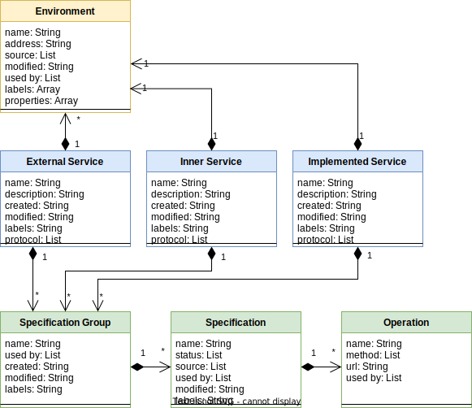
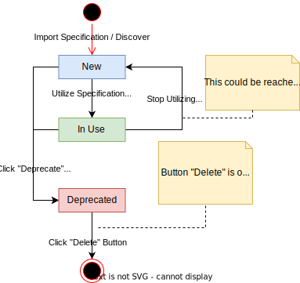

# Services

## Description

---

Most of the integration flows consider calling a particular service. "Service" in the context of Qubership Integration Platform, is an entity, that contains integration settings of real service, that exists inside or outside of it. Integration settings, that are utilized by service consist of API specifications, environment addresses and properties, etc. To integrate with the services, configured in the system, it is required to add and properly set up specific elements in the chain.

There are next possible service types, supported by the system:

- [External](1__External/external.md) - services available only via Egress Gateway. Usable in [Service Call](../01__Chains/1__Graph/1__QIP_Elements_Library/7__Senders/6__Service_Call/service_call.md) and [AsyncAPI Trigger](../01__Chains/1__Graph/1__QIP_Elements_Library/6__Triggers/3__AsyncAPI_Trigger/asyncapi_trigger.md) elements.
- [Inner Cloud](2__Inner_Cloud/inner_cloud.md) - also called "Internal Services". Such services share same K8S environment with QIP and may be called directly. Usable in [Service Call](../01__Chains/1__Graph/1__QIP_Elements_Library/7__Senders/6__Service_Call/service_call.md) and [AsyncAPI Trigger](../01__Chains/1__Graph/1__QIP_Elements_Library/6__Triggers/3__AsyncAPI_Trigger/asyncapi_trigger.md) elements.
- [Implemented](3__Implemented/implemented.md) - custom services, usually created from [HTTP Trigger](../01__Chains/1__Graph/1__QIP_Elements_Library/6__Triggers/1__HTTP_Trigger/http_trigger.md).
- [Context](4__Context/context.md) - database instance used for storing chain contexts, further enabling creation, retrieval and deletion of context data. Usable in [Context Storage](../01__Chains/1__Graph/1__QIP_Elements_Library/4__Services/1__Context_Storage/context_storage.md) element.

### Services data model

Services consist of next entities:
- **API Specification group** - services may have different groups of specifications, differentiated per business or technical logic. For example, one group may contain specifications, required for customer managements and another - for order managements. Not available for Context services.
- **API Specification** - contains standardized description of available operations. Not available for Context services.
- **Operation** - describes exact endpoint, related to particular business operation. Not available for Context services.
- **Environment** - Each Dev, QA or Production environment must have specific address by which service will be available for API calling. Depending on its type, service may have specific limitations for quantity of the environments:
	- **one** environment: for **Inner Cloud** and **Implemented services**.
	- **multiple** environments:  for **External services**.
	- **no** environments: for **Context services**

>ℹ️**Note**: Environment's address field for <b>http</b>-based services may be inactive, which means that route registration on Egress is globally disabled in CMBD. In this case, registration must be performed manually.

### API Specification Status Lifecycle

API Specification statuses details:

🔵 **New** - initial state of API specification, uploaded manually or imported by service discovery. 
🟢 **In Use** - status indicates that API Specification is utilized within at least one chain. 
🔴 **Deprecated** - this status indicates that such specification is outdated and won't be available for selection in newly added chain elements. Old elements, where specification with this status is already selected may still continue using it.

>ℹ️**Notes**:<li>It is only possible to delete **deprecated** API specifications, not used in any chain.</li><li>API Specification versions are based on information from specification itself, hence microservices **must** provide proper specification files with actual metadata.</li>
