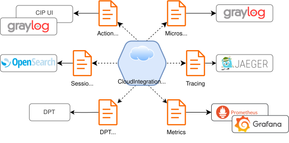

# Logging

## Description

---

### Overview

During the operating, Cloud Integration Platform has a capability of producing logs in according to the settings. There are multiple types of logs and structures that are utilized for different purposes. In a global sense, logs are essential to track the system behavior and capture specific events in order to analyze them and promptly provide a fix if necessary. All details about each particular logging aspect are mentioned below under respective section.



### Microservice Logs

This type of logs is being produced by Cloud Integration Platform in a **stdout** (standard output) manner, that means that produced logs shall be "captured" by some application or engine in order to collect them (e.g. **Graylog** via **Logging Agent**).

> ️ℹ️️ By default, Cloud Integration Platform has WARNING logging level for all microservices.

**Message format:**

CIP Microservice log can be produced either in `json` (default) or `text` format (configurable via ```LOG_FORMAT``` environment parameter).

Message consist from two different parts:

- *standardized part* with parameters specified in accordance to [Logging-Development guide]
- *custom part* with specific Cloud Integration Platform parameters, that described below

> ⚠️ CIP does not send any data to **business\_identifiers**.

**CIP Specific Parameters**

Following table contains list of CIP-specific parameters, that will be added **on top of** the standardized list.

| Param              | Availability               | Description                                                                                                     |
|:-------------------|:---------------------------|:----------------------------------------------------------------------------------------------------------------|
| session\_id        | All types of calls         | Session id.                                                                                                     |
| chain\_id          | All types of calls         | Chain id, object id of the chain, available in chain list.                                                      |
| correlation\_id    | All types of calls         | When correlation id is available it will be logged. Its purpose is to logically connect multiple session on UI. |
| chain              | All types of calls         | Chain name.                                                                                                     |
| chain\_element\_id | All types of calls         | Object id of the element within the chain, that produced the message.                                           |
| chain\_element     | All types of calls         | Chain element name.                                                                                             |
| log\_type          | Inbound and outbound calls | Constant, always equals to "int". This parameter is being set only for inbound and outbound calls.              |
| `url`              | REST outbound calls        | URL, to where call has been passed.                                                                             |
| responseCode       | REST outbound calls        | Response code, received from source. Blank if direction = request                                               |
| responseTime       | REST outbound calls        | Response time, shows call processing time in **milliseconds**. Blank if direction = request                     |
| direction          | REST outbound calls        | Shows the direction of the call. Possible values: <br/>- request<br>- response                                  |

**Message sample for successful REST inbound call:**

**Text format**

```text
2022-08-17T10:11:07.129388551Z [2022-08-17T10:11:07.129][INFO ] [request_id=1660731067128.0.7228021061350399] [tenant_id=cloud-common ] [traceId=- ] [spanId=- ] [originating_bi_id=- ] [business_identifiers=- ] [thread=0.0-8080-exec-8] [class=o.q.i.platform.engine.service.debugger.CamelDebugger        ] [method=logBeforeProcessByType ] [session_id=b702f2b9-58fa-4f24-8ccb-f7c9a59ad329] [chain_id=ff3ecdb8-1907-4435-8aa1-32061b341ecc] [chain=New Chain ] [chain_element_id=54b43763-8338-4a6a-80ea-2a60d3ae412c] [chain_element=HTTP Trigger ] [log_type=int] Get request from trigger. Headers: {CamelHttpUrl=http://localhost:8092/routes/test1, X-Request-Id=1660731067128.0.7228021061350399}, body: <body not logged>, exchange properties: {}
```

**JSON format**

```json
{
    "time":"2026-06-08T15:38:54.388",
    "level":"INFO",
    "message":"Get request from trigger.",
    "request_id":"f78bcac12c746f329dd2ed69f21795ed",
    "tenant_id":"e393a7a6-1920-4082-87d2-69179fd8e6f0",
    "thread":"0.0-8080-exec-9",
    "class":"o.q.i.platform.engine.service.debugger.logging.ChainLogger",
    "traceId":"-",
    "spanId":"-",
    "originating_bi_id":"-",
    "business_identifiers":"-",
    "method":"info",
    "log_type":"int",
    "session_id":"978ee143-8319-404d-a361-84a9b6d8701d",
    "chain_id":"3b0e487d-352f-4ed4-a0c2-8ff831be404d",
    "chain":"test-log-format",
    "chain_element_id":"76c818eb-f021-40bd-b0f8-430b77638239",
    "chain_element":"HTTP Trigger",
    "exchange_properties":"{}",
    "exchange_headers":"{content-length=0, x-forwarded-proto=https, CamelHttpCharacterEncoding=UTF-8, a-lot-of-other-headers=...}"
}
```

**Message sample for successful REST inbound call (with exchange properties):**

```text
2022-08-17T10:11:07.129388551Z [2022-08-17T10:11:07.129][INFO ] [request_id=1660731067128.0.7228021061350399] [tenant_id=cloud-common ] [traceId=- ] [spanId=- ] [originating_bi_id=- ] [business_identifiers=- ] [thread=0.0-8080-exec-8] [class=o.q.i.platform.engine.service.debugger.CamelDebugger        ] [method=logBeforeProcessByType ] [session_id=b702f2b9-58fa-4f24-8ccb-f7c9a59ad329] [chain_id=ff3ecdb8-1907-4435-8aa1-32061b341ecc] [chain=New Chain ] [chain_element_id=54b43763-8338-4a6a-80ea-2a60d3ae412c] [chain_element=HTTP Trigger ] [log_type=int] Get request from trigger. Headers: {CamelHttpUrl=http://localhost:8092/routes/test1, X-Request-Id=1660731067128.0.7228021061350399}, body: <body not logged>, exchange properties: {x-property-3={java.math.BigInteger, 10000}, x-property-1={java.lang.String, prop_value_1}, x-property-2={java.lang.String, prop_value_2}}
```

**Message sample for successful REST inbound call (with body):**

```text
[2023-10-03T12:09:05.644][INFO ] [request_id=d48034c009647366e83e6a75de64f256] [tenant_id=7379706c-ee6a-4487-a48a-03962958ea60] [traceId=- ] [spanId=- ] [correlation_id=- ] [originating_bi_id=- ] [business_identifiers=- ] [thread=0.0-8080-exec-1] [class=o.q.i.platform.engine.service.debugger.logging.ChainLogger  ] [method=logHttpRequest ] [session_id=d9860fc9-8d90-4028-848b-decdbab6a08e] [chain_id=692c05ce-a1ef-414c-adfd-4168c4b7b24f] [chain=Test - Restart ] [chain_element_id=2fe802bd-44bf-4a9f-924b-a3f994674656] [chain_element=Service Call ] [log_type=int] [url=qubership-integration-platform-variables-management:8080/authPolicy] [responseCode=- ] [responseTime=- ] [direction=request ] Send HTTP request. Headers: {x-envoy-internal=true, content-length=65, cor-id=7777, x-forwarded-proto=https, postman-token=2dfdff0f-292d-41bc-9fe0-6f15ab8020c2, CamelHttpCharacterEncoding=UTF-8, x-forwarded-port=443, CamelHttpServletRequest=SecurityContextHolderAwareRequestWrapper[ org.springframework.security.web.header.HeaderWriterFilter$HeaderWriterRequest@1501884a], accept=*/*, x-envoy-original-path=/cip-routes/check, authorization=Bearer eyJhb...Jvc
```

**Message sample for successful REST outbound call (direction = request):**

```text
2022-08-17T10:11:07.130189723Z [2022-08-17T10:11:07.130][INFO ] [request_id=1660731067128.0.7228021061350399] [tenant_id=cloud-common ] [traceId=- ] [spanId=- ] [originating_bi_id=- ] [business_identifiers=- ] [thread=0.0-8080-exec-8] [class=o.q.i.platform.engine.service.debugger.CamelDebugger        ] [method=logHttpRequest ][session_id=b702f2b9-58fa-4f24-8ccb-f7c9a59ad329] [chain_id=ff3ecdb8-1907-4435-8aa1-32061b341ecc] [chain=New Chain ] [chain_element_id=a28b854c-e172-40a1-a2c1-830160b8f3c3] [chain_element=HTTP Sender ] [log_type=int] [url=http://host.docker.internal:8080 ] [responseCode=- ] [responseTime=- ] [direction=request ] Send HTTP request. Headers: {X-Request-Id=1660731067128.0.7228021061350399, postman-token=d3d8e262-5fab-494d-9c05-094f28639fa2}, body: <body not logged>, exchange properties: {}
```

**Message sample for successful REST inbound call (direction = response):**

```text
2022-08-17T10:11:07.147800591Z [2022-08-17T10:11:07.147][INFO ] [request_id=1660731067128.0.7228021061350399] [tenant_id=cloud-common ] [traceId=- ] [spanId=- ] [originating_bi_id=- ] [business_identifiers=- ] [thread=0.0-8080-exec-8] [class=o.q.i.platform.engine.service.debugger.CamelDebugger        ] [method=logAfterProcessByType ] [session_id=b702f2b9-58fa-4f24-8ccb-f7c9a59ad329] [chain_id=ff3ecdb8-1907-4435-8aa1-32061b341ecc] [chain=New Chain ] [chain_element_id=a28b854c-e172-40a1-a2c1-830160b8f3c3] [chain_element=HTTP Sender ] [log_type=int] [url=http://host.docker.internal:8080 ] [responseCode=200] [responseTime=17 ] [direction=response] HTTP request completed. Headers: {CamelHttpResponseCode=200, Server=nginx/1.11.4, X-Request-Id=1660731067128.0.7228021061350399, postman-token=d3d8e262-5fab-494d-9c05-094f28639fa2}, body: <body not logged>, exchange properties: {}
```

**Message sample for inbound Kafka message:**

```text
2022-08-17T10:19:19.207081433Z [2022-08-17T10:19:19.206][INFO ] [request_id=1660731559205.0.6961940234207552] [tenant_id=cloud-common ] [traceId=- ] [spanId=- ] [originating_bi_id=- ] [business_identifiers=- ] [thread=Consumer[test1]] [class=o.q.i.platform.engine.service.debugger.CamelDebugger        ] [method=logBeforeProcessByType ] [session_id=2b071fa0-c54f-423c-8b5f-efe39bbd5770] [chain_id=ff3ecdb8-1907-4435-8aa1-32061b341ecc] [chain=New Chain ] [chain_element_id=0d58aeb4-c32d-4b89-8c0a-6edbcbea16dd] [chain_element=Kafka Trigger ] [log_type=int] Get request from trigger. Headers: {kafka.TIMESTAMP=1660731557399, CamelMessageTimestamp=1660731557399, Tenant=cloud-common, kafka.HEADERS=RecordHeaders(headers = [], isReadOnly = false), X-Request-Id=1660731559205.0.6961940234207552, kafka.OFFSET=1, kafka.TOPIC=test1, kafka.KEY=, kafka.PARTITION=0}, body: <body not logged>, exchange properties: {}
```

**Message sample for outbound Kafka message:**

```text
2022-08-17T10:19:19.208177816Z [2022-08-17T10:19:19.207][INFO ] [request_id=1660731559205.0.6961940234207552] [tenant_id=cloud-common ] [traceId=- ] [spanId=- ] [originating_bi_id=- ] [business_identifiers=- ] [thread=Consumer[test1]] [class=o.q.i.platform.engine.service.debugger.CamelDebugger        ] [method=logBeforeProcessByType ] [session_id=2b071fa0-c54f-423c-8b5f-efe39bbd5770] [chain_id=ff3ecdb8-1907-4435-8aa1-32061b341ecc] [chain=New Chain ] [chain_element_id=f993945b-8158-4a88-92c5-5ca3beae967d] [chain_element=Kafka Sender ] [log_type=int] Send request to queue. Headers: {kafka.TIMESTAMP=1660731557399, CamelMessageTimestamp=1660731557399, Tenant=cloud-common, kafka.HEADERS=RecordHeaders(headers = [], isReadOnly = false), X-Request-Id=1660731559205.0.6961940234207552, kafka.OFFSET=1, kafka.TOPIC=test1, kafka.KEY=, kafka.PARTITION=0}, body: <body not logged>, exchange properties: {}
```

**Message sample for outbound Kafka message (message has been placed to the queue):**

```text
2022-08-17T10:19:19.210685374Z [2022-08-17T10:19:19.210][INFO ] [request_id=1660731559205.0.6961940234207552] [tenant_id=cloud-common ] [traceId=- ] [spanId=- ] [originating_bi_id=- ] [business_identifiers=- ] [thread=Producer[test2]] [class=o.q.i.platform.engine.service.debugger.CamelDebugger        ] [method=logAfterProcessByType ] [session_id=2b071fa0-c54f-423c-8b5f-efe39bbd5770] [chain_id=ff3ecdb8-1907-4435-8aa1-32061b341ecc] [chain=New Chain ] [chain_element_id=f993945b-8158-4a88-92c5-5ca3beae967d] [chain_element=Kafka Sender ] [log_type=int] Sending message to queue completed. Headers: {kafka.TIMESTAMP=1660731557399, CamelMessageTimestamp=1660731557399, Tenant=cloud-common, kafka.HEADERS=RecordHeaders(headers = [], isReadOnly = false), X-Request-Id=1660731559205.0.6961940234207552, kafka.OFFSET=1, kafka.TOPIC=test1, kafka.KEY=, kafka.PARTITION=0, org.apache.kafka.clients.producer.RecordMetadata=[test2-0@1]}, body: <body not logged>, exchange properties: {}
```

**Message sample for import instructions file upload:**

```text
2024-10-16T09:36:26.210685374Z [2024-10-16T09:36:26.725] [INFO ] [request_id=0173873bb8a872327b00e6c528118cbd] [tenant_id=e393a7a6-1920-4082-87d2-69179fd8e6f0] [thread=0.0-8080-exec-7] [class=o.q.i.p.r.c.rest.v1.controller.ImportInstructionsController ] [traceId=- ] [spanId=- ] [originating_bi_id=- ] [business_identifiers={} ] [method=uploadImportInstructionsConfig] [error_code=- ] [log_type=- ] - Request to upload import instructions config from file common-variables.yaml
```

#### Circuit Breaker

Cloud Integration Platform also logs events from Circuit Breaker element (if it is used in the chain). Available events and message format:

- **Circuit Breaker registers a call:** "Circuit breaker recorded a successful call. Elapsed time: {} ms."
- **Circuit Breaker registers an error:** "Circuit breaker recorded an error: '{}'. Elapsed time: {} ms.",
- **Circuit Breaker changes the status:** "Circuit breaker changed state from *%STATUS%* to *%STATUS%*."
- **Circuit Breaker registers ignored error:** "Circuit breaker recorded an error which has been ignored: '{}'. Elapsed time: {} ms."
- **Circuit Breaker rejects a call due to OPEN status:** "Circuit breaker recorded a call which was not permitted. Circuit breaker state is {}."
- **Circuit Breaker registers high failure rate:** "Circuit breaker exceeded failure rate threshold. Current failure rate: {}.",
- **Circuit Breaker registers high failure rate (slow calls):** "Circuit breaker exceeded slow call rate threshold. Current slow call rate: {}.",

> ⚠️ Circuit Breaker events will be logged if logging level is **INFO**. When **WARNING** logging level is selected, only the events of switching status from CLOSED to OPEN will be logged with details about reason (slow calls or high failure rate).

Please refer to the few samples below:

**Circuit Breaker changes status from CLOSED to OPEN (slow calls):**

```text
2023-07-12T13:38:49.615877978Z [2023-07-12T13:38:49.615][INFO ] [request_id=1689169126568.0.1875260801475448] [tenant_id=00000000-0000-0000-0000-000000000000] [traceId=-               ] [spanId=-               ] [originating_bi_id=-                                   ] [business_identifiers=-                                   ] [thread=0.0-8080-exec-4] [class=o.q.i.platform.engine.camel.CustomResilienceReifier         ] [method=mbda$configureEventPublisher$1] [error_code=-               ] [session_id=43bcfba5-d9ec-4280-9451-c7a03b851f08] [chain_id=0e5a49de-15c9-4284-859f-b1a377b29d98] [chain=CLOUDCRM-201213               ] [chain_element_id=518f43b1-088b-4f89-9ab6-94876f041583] [chain_element=Circuit Breaker Configuration] [log_type=int] Circuit breaker recorded a successful call. Elapsed time: 2104 ms.
2023-07-12T13:38:49.627325745Z [2023-07-12T13:38:49.625][WARN ] [request_id=1689169126568.0.1875260801475448] [tenant_id=00000000-0000-0000-0000-000000000000] [traceId=-               ] [spanId=-               ] [originating_bi_id=-                                   ] [business_identifiers=-                                   ] [thread=0.0-8080-exec-4] [class=o.q.i.platform.engine.camel.CustomResilienceReifier         ] [method=mbda$configureEventPublisher$7] [error_code=-               ] [session_id=43bcfba5-d9ec-4280-9451-c7a03b851f08] [chain_id=0e5a49de-15c9-4284-859f-b1a377b29d98] [chain=CLOUDCRM-201213               ] [chain_element_id=518f43b1-088b-4f89-9ab6-94876f041583] [chain_element=Circuit Breaker Configuration] [log_type=int] Circuit breaker exceeded slow call rate threshold. Current slow call rate: 100.0.
2023-07-12T13:38:49.640152742Z [2023-07-12T13:38:49.639][WARN ] [request_id=1689169126568.0.1875260801475448] [tenant_id=00000000-0000-0000-0000-000000000000] [traceId=-               ] [spanId=-               ] [originating_bi_id=-                                   ] [business_identifiers=-                                   ] [thread=0.0-8080-exec-4] [class=o.q.i.platform.engine.camel.CustomResilienceReifier         ] [method=mbda$configureEventPublisher$0] [error_code=-               ] [session_id=43bcfba5-d9ec-4280-9451-c7a03b851f08] [chain_id=0e5a49de-15c9-4284-859f-b1a377b29d98] [chain=CLOUDCRM-201213               ] [chain_element_id=518f43b1-088b-4f89-9ab6-94876f041583] [chain_element=Circuit Breaker Configuration] [log_type=int] Circuit breaker changed state from CLOSED to OPEN.
```

**Circuit Breaker changes status from HALF-OPEN to OPEN:**

```text
2023-07-12T13:41:41.503032125Z [2023-07-12T13:41:41.502][INFO ] [request_id=1689169126568.0.1875260801475450] [tenant_id=00000000-0000-0000-0000-000000000000] [traceId=-               ] [spanId=-               ] [originating_bi_id=-                                   ] [business_identifiers=-                                   ] [thread=0.0-8080-exec-7] [class=o.q.i.platform.engine.camel.CustomResilienceReifier         ] [method=mbda$configureEventPublisher$0] [error_code=-               ] [session_id=44fa5d33-4f37-4e08-9e09-50e3774a5150] [chain_id=0e5a49de-15c9-4284-859f-b1a377b29d98] [chain=CLOUDCRM-201213               ] [chain_element_id=-                                   ] [chain_element=-              ] [log_type=int] Circuit breaker changed state from OPEN to HALF_OPEN.
2023-07-12T13:41:43.508432860Z [2023-07-12T13:41:43.507][INFO ] [request_id=1689169126568.0.1875260801475450] [tenant_id=00000000-0000-0000-0000-000000000000] [traceId=-               ] [spanId=-               ] [originating_bi_id=-                                   ] [business_identifiers=-                                   ] [thread=0.0-8080-exec-7] [class=o.q.i.platform.engine.camel.CustomResilienceReifier         ] [method=mbda$configureEventPublisher$1] [error_code=-               ] [session_id=44fa5d33-4f37-4e08-9e09-50e3774a5150] [chain_id=0e5a49de-15c9-4284-859f-b1a377b29d98] [chain=CLOUDCRM-201213               ] [chain_element_id=518f43b1-088b-4f89-9ab6-94876f041583] [chain_element=Circuit Breaker Configuration] [log_type=int] Circuit breaker recorded a successful call. Elapsed time: 2005 ms.
```

**Circuit Breaker instantly rejects calls due to OPEN status:**

```text
2023-07-12T13:42:19.513088976Z [2023-07-12T13:42:19.511][INFO ] [request_id=1689169126568.0.1875260801475476] [tenant_id=00000000-0000-0000-0000-000000000000] [traceId=-               ] [spanId=-               ] [originating_bi_id=-                                   ] [business_identifiers=-                                   ] [thread=0.0-8080-exec-6] [class=o.q.i.platform.engine.camel.CustomResilienceReifier         ] [method=mbda$configureEventPublisher$5] [error_code=-               ] [session_id=a78c4c3a-ea96-4c11-93b0-b0f395a60e28] [chain_id=0e5a49de-15c9-4284-859f-b1a377b29d98] [chain=CLOUDCRM-201213               ] [chain_element_id=-                                   ] [chain_element=-              ] [log_type=int] Circuit breaker recorded a call which was not permitted. Circuit breaker state is OPEN.
2023-07-12T13:42:22.750370708Z [2023-07-12T13:42:22.748][INFO ] [request_id=1689169126568.0.1875260801475476] [tenant_id=00000000-0000-0000-0000-000000000000] [traceId=-               ] [spanId=-               ] [originating_bi_id=-                                   ] [business_identifiers=-                                   ] [thread=0.0-8080-exec-8] [class=o.q.i.platform.engine.camel.CustomResilienceReifier         ] [method=mbda$configureEventPublisher$5] [error_code=-               ] [session_id=6991b7ec-a24f-4ef7-84ed-bfd8d65a0b95] [chain_id=0e5a49de-15c9-4284-859f-b1a377b29d98] [chain=CLOUDCRM-201213               ] [chain_element_id=-                                   ] [chain_element=-              ] [log_type=int] Circuit breaker recorded a call which was not permitted. Circuit breaker state is OPEN.
2023-07-12T13:42:23.588069456Z [2023-07-12T13:42:23.587][INFO ] [request_id=1689169126568.0.1875260801475476] [tenant_id=00000000-0000-0000-0000-000000000000] [traceId=-               ] [spanId=-               ] [originating_bi_id=-                                   ] [business_identifiers=-                                   ] [thread=.0-8080-exec-10] [class=o.q.i.platform.engine.camel.CustomResilienceReifier         ] [method=mbda$configureEventPublisher$5] [error_code=-               ] [session_id=7810e5bc-2b0f-4c0e-b4c1-03d0ee3f1b7b] [chain_id=0e5a49de-15c9-4284-859f-b1a377b29d98] [chain=CLOUDCRM-201213               ] [chain_element_id=-                                   ] [chain_element=-              ] [log_type=int] Circuit breaker recorded a call which was not permitted. Circuit breaker state is OPEN.
```

#### Loop

Loop element produces error messages, when parameter "Maximum iteration count" is marked and maximum iteration reached. Next message is generated:

- **Maximum number of iterations reached**

Sample:

```text
[2024-01-16T15:56:14.688] [ERROR] [request_id=1705420574671.0.04277088906452009] [tenant_id=00000000-0000-0000-0000-000000000000] [thread=0.0-8080-exec-1] [class=o.apache.camel.processor.errorhandler.DefaultErrorHandler   ] [traceId=-               ] [spanId=-               ] [originating_bi_id=-                                   ] [business_identifiers=-                                   ] [method=log                           ] [error_code=CIP-0103] [log_type=int] - Failed delivery for (MessageId: DD975E4F7957628-0000000000000002 on ExchangeId: DD975E4F7957628-0000000000000002). Exhausted after delivery attempt: 1 caught: org.qubership.integration.platform.engine.camel.exceptions.IterationLimitException: Maximum number of iterations reached
 Message History (source location is disabled)
 ---------------------------------------------------------------------------------------------------------------------------------------
 Source                                   ID                             Processor                                          Elapsed (ms)
                                          route1/route1                  from[servlet-custom:/loop?chunked=true&httpBinding     29409283
                                          route1/7cae0fa0-5719-4cac-a925 ref:httpTriggerProcessor                                      1
 Stacktrace
 ---------------------------------------------------------------------------------------------------------------------------------------
 org.qubership.integration.platform.engine.camel.exceptions.IterationLimitException: Maximum number of iterations reached
     at java.base/jdk.internal.reflect.NativeConstructorAccessorImpl.newInstance0(Native Method)
     at java.base/jdk.internal.reflect.NativeConstructorAccessorImpl.newInstance(NativeConstructorAccessorImpl.java:77)
```

#### Bulk Remove Snapshots

```text
[2023-10-26T09:45:22.920] [INFO ] [request_id=1698313522919.0.9383872714175358] [tenant_id=00000000-0000-0000-0000-000000000000] [thread=0.0-8080-exec-2] [class=o.q.i.p.r.catalog.rest.v1.controller.MaintenanceController  ] [traceId=-               ] [spanId=-               ] [originating_bi_id=-                                   ] [business_identifiers={}                                  ] [method=pruneSnapshots                ] [error_code=-               ] [log_type=-  ] - Request to clear snapshots older than 3 day(s) by 1000 snapshots
[2023-10-26T09:45:23.362] [DEBUG] [request_id=-              ] [tenant_id=00000000-0000-0000-0000-000000000000] [thread=onPool-worker-1] [class=o.q.i.platform.runtime.catalog.service.SnapshotService      ] [traceId=-               ] [spanId=-               ] [originating_bi_id=-                                   ] [business_identifiers=-                                   ] [method=pruneSnapshots                ] [error_code=-               ] [log_type=-  ] - Snapshots chunk of 1000 removed, currently removed 1000

...

[2023-10-26T09:45:28.237] [DEBUG] [request_id=-              ] [tenant_id=00000000-0000-0000-0000-000000000000] [thread=onPool-worker-1] [class=o.q.i.platform.runtime.catalog.service.SnapshotService      ] [traceId=-               ] [spanId=-               ] [originating_bi_id=-                                   ] [business_identifiers=-                                   ] [method=pruneSnapshots                ] [error_code=-               ] [log_type=-  ] - Snapshots chunk of 732 removed, currently removed 12732
[2023-10-26T09:45:28.242] [DEBUG] [request_id=-              ] [tenant_id=00000000-0000-0000-0000-000000000000] [thread=onPool-worker-1] [class=o.q.i.platform.runtime.catalog.service.SnapshotService      ] [traceId=-               ] [spanId=-               ] [originating_bi_id=-                                   ] [business_identifiers=-                                   ] [method=pruneSnapshots                ] [error_code=-               ] [log_type=-  ] - Snapshots chunk of 0 removed, currently removed 12732
[2023-10-26T09:45:28.243] [INFO ] [request_id=-              ] [tenant_id=00000000-0000-0000-0000-000000000000] [thread=onPool-worker-1] [class=o.q.i.platform.runtime.catalog.service.SnapshotService      ] [traceId=-               ] [spanId=-               ] [originating_bi_id=-                                   ] [business_identifiers=-                                   ] [method=pruneSnapshots                ] [error_code=-               ] [log_type=-  ] - Snapshots removed successfully: 12732. Time elapsed: 6 seconds
```

#### Kafka and RabbitMQ

Cloud Integration Platform will log respective global messages when Deployment fails with Kafka or RabbitMQ related issues.

Kafka:

- **Kafka topic, specified in the element is not found:** "Topic with classifier test.command.queue not found"
- **Kafka authorization issue:** "Kafka predeploy check is failed with AuthorizationException. Exception not thrown"
- **Unexpected Kafka connection error:** "Predeploy check is failed. Connection configuration is invalid, topics not found or broker is unavailable"
- **Mandatory Topic parameter is not specified:** "Topic property can't be empty"
- **Generic error (unable to identify exact scenario):** "Failed to check kafka topic(s) or connection for deployment: %*identifier%*, element: %*identifier%*"
- **Unable to get Kafka topic from MaaS (Common MaaS error):** "Failed to get kafka topic from MaaS"
- **Unable to get proper response from MaaS:** "Failed to resolve MaaS parameters: servers for protocol %*protocol*% not found"

RabbitMQ:

- **Mandatory parameters are missing during configuration of RabbitMQ element:** "AMQP mandatory parameters are missing, check configuration"
- **Address, specified on chain's RabbitMQ element is invalid:** "AMQP addresses has invalid format, check configuration"
- **Exchange, specified during configuration of RabbitMQ element is not found:** "AMQP exchange %*exchange%* not found, check configuration"
- **Queue, specified during configuration of RabbitMQ element is not found:** "AMQP queue %*queue*% not found, check configuration"
- **Unable to reach broker:** "Connection configuration is invalid or broker is unavailable"
- **Generic error (unable to identify exact scenario):** "Failed to check amqp connection for deployment: %*identifier*%, element: %*identifier%*"
- **Unable to get Kafka topic from MaaS (Common MaaS error):** "Failed to get rabbitmq vHost from MaaS"

For each of the message related to Kafka or RabbitMQ, there will be a strack trace, that contains detailed information about the issue.

Please refer to the few samples below:

**Kafka topic not found:**

```text
[2023-09-13T13:34:28.261][ERROR] [request_id=-              ] [tenant_id=7379706c-ee6a-4487-a48a-03962958ea60] [traceId=-               ] [spanId=-               ] [correlation_id=-       ] [originating_bi_id=-                                   ] [business_identifiers={snapshotId=010f425d-94be-4eff-8e26-41d51136a931, chainId=010f425d-94be-4eff-8e26-41d51136a931, deploymentId=7160787a-4eb7-4fd3-b8df-7a78e5678241}] [thread=ymentExecutor-3] [class=o.q.integration.platform.engine.cloudcore.maas.MaasService  ] [method=getKafkaTopic                 ] [error_code=-               ] [session_id=-                                   ] [chain_id=-                                   ] [chain=-                             ] [chain_element_id=-                                   ] [chain_element=-              ] [log_type=-  ] Failed to get kafka topic from MaaS
org.qubership.integration.platform.engine.cloudcore.maas.TopicNotFoundException: Topic with classifier order.command.queue not found
	at org.qubership.integration.platform.engine.cloudcore.maas.MaasService.lambda$getKafkaTopic$0(MaasService.java:185)
	at java.base/java.util.Optional.orElseThrow(Optional.java:403)
	at org.qubership.integration.platform.engine.cloudcore.maas.MaasService.getKafkaTopic(MaasService.java:185)
	at org.qubership.integration.platform.engine.cloudcore.maas.MaasService.resolveKafkaMaasMainParameters(MaasService.java:145)
	at org.qubership.integration.platform.engine.cloudcore.maas.MaasService.resolveServiceKafkaMaasParameters(MaasService.java:244)
	at org.qubership.integration.platform.engine.cloudcore.maas.MaasService.resolveDeploymentMaasParameters(MaasService.java:79)
	at org.qubership.integration.platform.engine.service.IntegrationRuntimeService.preprocessDeploymentConfigurationXml(IntegrationRuntimeService.java:470)
	at org.qubership.integration.platform.engine.service.IntegrationRuntimeService.processDeployment(IntegrationRuntimeService.java:422)
	at org.qubership.integration.platform.engine.service.IntegrationRuntimeService.processDeploymentUpdate(IntegrationRuntimeService.java:333)
	at org.qubership.integration.platform.engine.service.IntegrationRuntimeService.lambda$process$0(IntegrationRuntimeService.java:300)
	at java.base/java.util.concurrent.CompletableFuture$AsyncRun.run(CompletableFuture.java:1804)
	at java.base/java.util.concurrent.ThreadPoolExecutor.runWorker(ThreadPoolExecutor.java:1136)
	at java.base/java.util.concurrent.ThreadPoolExecutor$Worker.run(ThreadPoolExecutor.java:635)
	at java.base/java.lang.Thread.run(Thread.java:833)
```

**AMQP addresses has invalid format:**

```text
[2023-09-13T14:32:17.241][ERROR] [request_id=-              ] [tenant_id=7379706c-ee6a-4487-a48a-03962958ea60] [traceId=-               ] [spanId=-               ] [correlation_id=-       ] [originating_bi_id=-                                   ] [business_identifiers={snapshotId=a98d4615-4462-4a5f-b7bf-8b70b19ab6f0, chainId=a98d4615-4462-4a5f-b7bf-8b70b19ab6f0, deploymentId=398c4c35-16db-4367-87ec-e425a7d2cdac}] [thread=ymentExecutor-1] [class=o.q.i.p.e.s.d.p.a.context.before.AmpqConnectionCheckAction  ] [method=apply                         ] [error_code=-               ] [session_id=-                                   ] [chain_id=-                                   ] [chain=-                             ] [chain_element_id=faa0b211-4c6b-4616-9b1b-578bc240980a] [chain_element=-              ] [log_type=-  ] AMQP predeploy check is failed
java.lang.IllegalArgumentException: AMQP addresses has invalid format, check configuration
	at org.qubership.integration.platform.engine.service.deployment.processing.actions.context.before.AmpqConnectionCheckAction.apply(AmpqConnectionCheckAction.java:116)
	at org.qubership.integration.platform.engine.service.deployment.processing.ElementProcessingAction.processElement(ElementProcessingAction.java:54)
	at org.qubership.integration.platform.engine.service.deployment.processing.ElementProcessingAction.execute(ElementProcessingAction.java:41)
	at org.qubership.integration.platform.engine.service.deployment.processing.DeploymentProcessingService.executeAction(DeploymentProcessingService.java:95)
	at org.qubership.integration.platform.engine.service.deployment.processing.DeploymentProcessingService.executeActions(DeploymentProcessingService.java:84)
	at org.qubership.integration.platform.engine.service.deployment.processing.DeploymentProcessingService.processBeforeContextCreated(DeploymentProcessingService.java:55)
	at org.qubership.integration.platform.engine.service.IntegrationRuntimeService.processDeployment(IntegrationRuntimeService.java:424)
	at org.qubership.integration.platform.engine.service.IntegrationRuntimeService.processDeploymentUpdate(IntegrationRuntimeService.java:333)
	at org.qubership.integration.platform.engine.service.IntegrationRuntimeService.lambda$process$0(IntegrationRuntimeService.java:300)
	at java.base/java.util.concurrent.CompletableFuture$AsyncRun.run(CompletableFuture.java:1804)
	at java.base/java.util.concurrent.ThreadPoolExecutor.runWorker(ThreadPoolExecutor.java:1136)
	at java.base/java.util.concurrent.ThreadPoolExecutor$Worker.run(ThreadPoolExecutor.java:635)
	at java.base/java.lang.Thread.run(Thread.java:833)
```

**Consumer is not able to process the batch:**

```text
...
[Consumer clientId=XXX, groupId=<groupId>-XXX] consumer poll timeout has expired. This means the time between subsequent calls to poll() was longer than the configured max.poll.interval.ms, which typically implies that the poll loop is spending too much time processing messages. You can address this either by increasing max.poll.interval.ms or by reducing the maximum size of batches returned in poll() with max.poll.records.
...
```

#### Sub-Chains

When chains, that are being deployed, are linked via [Chain Call](../../01__Chains/1__Graph/1__Elements_Library/1__Routing/6__Chain_Call/chain_call.md)/[Chain Trigger](../../01__Chains/1__Graph/1__Elements_Library/6__Triggers/2__Chain_Trigger/chain_trigger.md) the way it forms cyclic relationship, system registers an error:

- Found cyclic dependency for chain with id {}. Sequential deployment of all related sub-chains is not available, hence it will be performed in common mode
- Unable to find chain with trigger id {}. Sequential deployment of all related sub-chains is not available, hence it will be performed in common mode
- Unexpected error during connecting list of dependency chains. Sequential deployment of all related sub-chains is not available, hence it will be performed in common mode
- Chain trigger is not specified for Chain Call element with id: {}. Sequential deployment of all related sub-chains is not available, hence it will be performed in common mode

Sample:

```text
[ERROR] [request_id=1721990941495.0.750924224149779] [tenant_id=00000000-0000-0000-0000-000000000000] [thread=Thread-6       ] [class=o.q.i.p.r.c.service.deployment.DeploymentBuilderService     ] [traceId=-               ] [spanId=-               ] [originating_bi_id=-                                   ] [business_identifiers=-                                   ] [method=fillAdjacencyLists            ] [error_code=-               ] [log_type=-  ] - Chain trigger is not specified for Chain Call element with id: 98369b29-fcf3-4033-8ec6-bbf32a02cac1. Sequential deployment of all related sub-chains is not available, hence it will be performed in common mode
```

#### Auto-Retry

When [Service Call](../../01__Chains/1__Graph/1__Elements_Library/7__Senders/6__Service_Call/service_call.md) fails and there are retries configured for it, system attempt to make these retries accordingly. All attempts are properly logged, when logging is on.

Sample:

```text
[2024-09-04T11:20:02.088][WARN ] [request_id=1725448801924.0.8564590952947392] [tenant_id=00000000-0000-0000-0000-000000000000] [traceId=-               ] [spanId=-               ] [correlation_id=-       ] [originating_bi_id=-                                   ] [business_identifiers=-                                   ] [thread=.0-8080-exec-10] [class=o.q.i.platform.engine.service.debugger.logging.ChainLogger  ] [method=logRetryRequestAttempt        ] [error_code=-               ] [session_id=24f27b8c-fb28-4058-a118-9f111df95c54] [chain_id=349d27bd-a78b-4fe9-8057-0044505e4037] [chain=myChainName                  ] [chain_element_id=74d903fa-a7f7-4c0d-acf5-42ddd3c76757] [chain_element=Service Call   ] [log_type=int] Request failed and will be retried after 5000ms delay (retries left: 2): HTTP operation failed invoking http://host.docker.internal:8092/system/74d903fa-a7f7-4c0d-acf5-42ddd3c76757/d73108b16614c919c6a03b3f87884e4ce4e19b5d/pet/findByTags with statusCode: 503
[2024-09-04T11:20:02.089][INFO ] [request_id=1725448801924.0.8564590952947392] [tenant_id=00000000-0000-0000-0000-000000000000] [traceId=-               ] [spanId=-               ] [correlation_id=-       ] [originating_bi_id=-                                   ] [business_identifiers=-                                   ] [thread=.0-8080-exec-10] [class=o.q.i.platform.engine.service.debugger.logging.ChainLogger  ] [method=logRequestAttempt             ] [error_code=-               ] [session_id=24f27b8c-fb28-4058-a118-9f111df95c54] [chain_id=349d27bd-a78b-4fe9-8057-0044505e4037] [chain=myChainName                  ] [chain_element_id=74d903fa-a7f7-4c0d-acf5-42ddd3c76757] [chain_element=Service Call   ] [log_type=int] Request attempt: 2 (max 4).
```

### Session Logs

This type of logs is being gathered during session processing and catered to OpenSearch. Every inbound and outbound transactions are going to be captured according to the logging level, specified during the [chain deployment].

> Note
> - There is an option (configurable via [Deployment]) to enable temporal sessions buffering in a dedicated Kafka topic, decoupling the process from direct OpenSearch writes and mitigating performance issues
> - You can also set session level by sending HTTP header ***TraceMe*** in HTTP request. When header value is **"true"**, all available session parameters will be logged (as for session logging level "*Debug*") regardless of chain deployment configuration settings.

****Message format:****

*Session object*

| Parameter            | Data Type                                   | Description                                                                                                                                                                                        |
|:---------------------|:--------------------------------------------|:---------------------------------------------------------------------------------------------------------------------------------------------------------------------------------------------------|
| started              | String                                      | Contains datetime of session start in a format of yyyy-mm-ddThh:mm:ss.ms(6). <br/> Example: 2022-08-18T12:10:40.095473                                                                             |
| finished             | String                                      | Contains datetime of session finish in a format of yyyy-mm-ddThh:mm:ss.ms(6). <br/> Example: 2022-08-18T12:10:40.516770                                                                            |
| duration             | Number                                      | Session duration in milliseconds.                                                                                                                                                                  |
| syncDuration         | Number                                      | Synchronous session duration in milliseconds.                                                                                                                                                      |
| importedSession      | Boolean                                     | Indicates that session has been imported.                                                                                                                                                          |
| externalSessionCipId | String                                      | External session id, generated by external component. Used to link CIP session id and any other service's session id. <br/> Source for this parameter shall be **header**: external-session-cip-id |
| executionStatus      | String                                      | Session execution status. E.g. "COMPLETED\_NORMALLY".                                                                                                                                              |
| id                   | String                                      | Session identifier in UUID format.                                                                                                                                                                 |
| chainId              | String                                      | Chain identifier in UUID format.                                                                                                                                                                   |
| chainName            | String                                      | Chain name, specified during chain creation.                                                                                                                                                       |
| domain               | String                                      | Domain name.                                                                                                                                                                                       |
| domainType           | String                                      | Type of the domain, on which chain was executed. E.g. "CLASSIC" or "MICRO".                                                                                                                        |
| engineAddress        | String                                      | Engine ip address                                                                                                                                                                                  |
| loggingLevel         | String                                      | Settled logging level.                                                                                                                                                                             |
| snapshotName         | String                                      | Snapshot name.                                                                                                                                                                                     |
| correlationId        | String                                      | Correlation id, utilized to logically connect multiple session on UI.                                                                                                                              |
| parentSessionId      | String                                      | Id of the parent session, if current session was triggered from within another session.                                                                                                            |
| sessionElements      | Array of Objects (*Session Element object)* | Contains list of exact elements within the session.                                                                                                                                                |

*Session Element object*

| Parameters           | Data type                                         | Description                                                                                                                     |
|:---------------------|:--------------------------------------------------|:--------------------------------------------------------------------------------------------------------------------------------|
| started              | String                                            | Contains datetime of related session start in a format of yyyy-mm-ddThh:mm:ss.ms(6). <br/> Example: 2022-08-18T12:10:40.095473  |
| finished             | String                                            | Contains datetime of related session finish in a format of yyyy-mm-ddThh:mm:ss.ms(6). <br/> Example: 2022-08-18T12:10:40.516770 |
| duration             | Number                                            | Related session duration in milliseconds.                                                                                       |
| syncDuration         | Number                                            | Synchronous related session duration in milliseconds.                                                                           |
| executionStatus      | String                                            | Related session execution status. E.g. "COMPLETED\_NORMALLY".                                                                   |
| elementId            | String                                            | Session element identifier in UUID format.                                                                                      |
| sessionId            | String                                            | Related session identifier in UUID format.                                                                                      |
| chainElementId       | String                                            | Chain element identifier in UUID format.                                                                                        |
| actualElementChainId | String                                            | Id of the sub-chain element linked to session element, in case it is an element from a sub-chain.                               |
| parentElement        | String                                            | Parent element identifier in UUID format. Relation "parentElement" → "elementId"                                                |
| previousElement      | String                                            | Identifier of the element, that placed before the current one. Relation "previousElement" → "elementId"                         |
| elementName          | String                                            | Current element name.                                                                                                           |
| camelName            | String                                            | Camel name, that corresponds to the element. E.g. "try-catch-finally"                                                           |
| bodyBefore           | JSON Object                                       | JSON object, that contains the body that element consumed.                                                                      |
| bodyAfter            | JSON Object                                       | JSON object, that contains the body that element passes.                                                                        |
| headersBefore        | JSON Object                                       | JSON object, that contains the headers that element consumed.                                                                   |
| headersAfter         | JSON Object                                       | JSON object, that contains the headers that element passes.                                                                     |
| propertiesBefore     | JSON Object                                       | JSON object, that contains set of properties that element consumed.                                                             |
| propertiesAfter      | JSON Object                                       | JSON object, that contains set of properties that element passes.                                                               |
| contextBefore        | JSON Object                                       | JSON object, that contains set of context properties that element consumed.                                                     |
| contextAfter         | JSON Object                                       | JSON object, that contains set of context properties that element passes.                                                       |
| children             | Array of Objects <br/> (*Session Element object)* | Array of child elements.                                                                                                        |
| exceptionInfo        | Object <br/> (*Exception info)*                   | JSON object that contains exception information.                                                                                |

*Exception info*

| Parameter   | Date type   | Description                                                                                               |
|:------------|:------------|:----------------------------------------------------------------------------------------------------------|
| message     | String      | usually, user-friendly message, highlighting the exception. <br/> E.g.: HTTP operation failed invoking %% |
| stackTrace  | String      | Full stacktrace, received as the result of the exception.                                                 |

Message sample:

<details>
<summary>Click here to expand...</summary>

```json
[
    {
        "started": "2022-08-18T09:36:35.859438",
        "finished": "2022-08-18T09:36:37.083412",
        "duration": 1223,
        "syncDuration": 1223,
        "executionStatus": "COMPLETED_NORMALLY",
        "id": "3f1eef68-58ea-4b43-bb9d-798e1b2fb1b3",
        "chainId": "adab82d7-dcd1-43e0-b78b-8fae12a08391",
        "chainName": "chain 1",
        "domain": "default",
        "domainType": "CLASSIC",
        "engineAddress": "10.128.14.178",
        "loggingLevel": "DEBUG",
        "snapshotName": "V1",
        "correlationId": "null",
        "parentSessionId": null,
        "sessionElements": [
            {
                "started": "2022-08-18T09:36:36.923332",
                "finished": "2022-08-18T09:36:36.924728",
                "duration": 1,
                "syncDuration": 1,
                "executionStatus": "COMPLETED_NORMALLY",
                "elementId": "8f55d498-354d-4196-a8f9-3dfb2f956d9b",
                "sessionId": "3f1eef68-58ea-4b43-bb9d-798e1b2fb1b3",
                "chainElementId": "49918347-2385-431f-a7b4-39a86d51b2f6",
                "actualElementChainId": null,
                "parentElement": null,
                "previousElement": null,
                "elementName": "HTTP Trigger",
                "camelName": "http-trigger",
                "bodyBefore": "",
                "bodyAfter": "",
                "headersBefore": {
                    "postman-token": "00000000-0000-0000-0000-000000000000",
                    "cor": "cor",
                    "x-forwarded-port": "80",
                    "x-envoy-original-path": "/cip-routes/demo1808",
                    "authorization": "Bearer ...nGZn9lXQJHTQSlcw",
                    "Tenant": "9e1b240a-7d5c-49b9-b025-79e12bec8140",
                    "x-forwarded-host": "public-gateway.example.com",
                    "CamelHttpMethod": "GET",
                    "CamelServletContextPath": "/demo1808",
                    "host": "cloud-integration-platform-engine-v1:8080",
                    "CamelHttpQuery": "",
                    "x-envoy-internal": "true",
                    "x-request-id": "40227f0140b3ee6dcef133efd92a7b2e",
                    "CamelHttpUrl": "http://public-gateway.example.com/routes/demo1808",
                    "x-forwarded-proto": "http",
                    "CamelHttpCharacterEncoding": "UTF-8",
                    "CamelHttpServletRequest": "SecurityContextHolderAwareRequestWrapper[ org.springframework.security.web.header.HeaderWriterFilter$HeaderWriterRequest@8d26db]",
                    "accept": "*/*",
                    "x-real-ip": "10.236.151.139",
                    "CamelHttpServletResponse": "org.springframework.security.web.header.HeaderWriterFilter$HeaderWriterResponse@85f546",
                    "x-forwarded-scheme": "http",
                    "x-envoy-expected-rq-timeout-ms": "120000",
                    "x-scheme": "http",
                    "CamelHttpUri": "/routes/demo1808",
                    "accept-encoding": "gzip, deflate, br",
                    "CamelHttpPath": "",
                    "user-agent": "PostmanRuntime/7.29.2"
                },
                "headersAfter": {
                    "x-envoy-internal": "true",
                    "x-request-id": "40227f0140b3ee6dcef133efd92a7b2e",
                    "x-forwarded-proto": "http",
                    "postman-token": "00000000-0000-0000-0000-000000000000",
                    "CamelHttpCharacterEncoding": "UTF-8",
                    "cor": "cor",
                    "x-forwarded-port": "80",
                    "CamelHttpServletRequest": "SecurityContextHolderAwareRequestWrapper[ org.springframework.security.web.header.HeaderWriterFilter$HeaderWriterRequest@8d26db]",
                    "accept": "*/*",
                    "x-envoy-original-path": "/cip-routes/demo1808",
                    "authorization": "Bearer...uhnGZn9lXQJHTQSlcw",
                    "x-real-ip": "10.236.151.139",
                    "CamelHttpServletResponse": "org.springframework.security.web.header.HeaderWriterFilter$HeaderWriterResponse@85f546",
                    "x-forwarded-scheme": "http",
                    "Tenant": "9e1b240a-7d5c-49b9-b025-79e12bec8140",
                    "x-forwarded-host": "public-gateway.example.com",
                    "CamelHttpMethod": "GET",
                    "CamelServletContextPath": "/demo1808",
                    "host": "cloud-integration-platform-engine-v1:8080",
                    "CamelHttpQuery": "",
                    "x-envoy-expected-rq-timeout-ms": "120000",
                    "x-scheme": "http",
                    "accept-encoding": "gzip, deflate, br",
                    "user-agent": "PostmanRuntime/7.29.2"
                },
                "propertiesBefore": {},
                "propertiesAfter": {
                    "x-property-1": {
                        "type": "java.lang.String",
                        "value": "prop_value_1"
                    }
                },
                "contextBefore": {},
                "contextAfter": {},
                "children": [],
                "exceptionInfo": null
            }
        ]
    }
]
```

</details>

### DPT Logs

This type of logs are being produced only if specific option selected on "[Logging](../../01__Chains/5__Logging/logging.md)" tab for Chains. The purpose of this type of log is to track session start, finish and intermediate state(check-point).

**Message format:**

Headers

| Parameter         | Mandatory   | Data Type   | Description                                                                                                                                                                                                                                                                                                                         |
|:------------------|:------------|:------------|:------------------------------------------------------------------------------------------------------------------------------------------------------------------------------------------------------------------------------------------------------------------------------------------------------------------------------------|
| x-version         | O           | String      | X-Version value, required for blue-green deployment.                                                                                                                                                                                                                                                                                |
| x-version-name    | O           | String      | X-version name of application that produces the event in blue-green deployment scenario.                                                                                                                                                                                                                                            |
| x-idempotency-key | O           | String      | UUID generated unique key used to identify DPT events for idempotency. <br/>⚠️ The Time-to-Live (TTL) for the x-idempotency-key is determined through the environment parameter **`SESSIONS_CHECKPOINTS_CLEANUP_INTERVAL`**, i.e., calculated by adding the parameter value *(default is set to 1 month)* to the current timestamp. |

Body

| Parameter |                     | Data type                        | Mandatory | Description                                                                                                                                                                                                                                                                                                                                                                                                                                                                                                                                                                        |
|:----------|:--------------------|:---------------------------------|:----------|:-----------------------------------------------------------------------------------------------------------------------------------------------------------------------------------------------------------------------------------------------------------------------------------------------------------------------------------------------------------------------------------------------------------------------------------------------------------------------------------------------------------------------------------------------------------------------------------|
| source    |                     | Object                           | M         | Technical object, contains type of the event.                                                                                                                                                                                                                                                                                                                                                                                                                                                                                                                                      |
|           | type                | String                           | M         | Type of the event: <br/>- **SESSION\_STARTED** - session started. <br>- **SESSION\_CHECKPOINT\_PASSED** - there was a checkpoint in the chain, and it has been passed.<br>- **SESSION\_FINISHED** - session finished and its details are available in "after" object.<br>- **SESSION\_HANDLING\_FAILURE** - only used for retries, triggered by [Retry events from DPT (via Kafka)](../7__Retry_Events_From_DPT_Via_Kafka/retry_events_from_dpt_via_kafka.md). This type means that event can't be processed at all and even chain can't be started.                               |
| op        |                     | String                           | M         | Default: "c"                                                                                                                                                                                                                                                                                                                                                                                                                                                                                                                                                                       |
| after     |                     | Object                           | M         | Technical object, contains session details.                                                                                                                                                                                                                                                                                                                                                                                                                                                                                                                                        |
|           | sessionId           | String                           | M         | Primary key. Generated value for each new session.                                                                                                                                                                                                                                                                                                                                                                                                                                                                                                                                 |
|           | finishStatus        | String                           | С         | Mandatory for SESSION\_FINISHED events. Shows the status of finished session: <br/>- COMPLETED\_NORMALLY<br>- COMPLETED\_WITH\_WARNINGS<br>- COMPLETED\_WITH\_ERRORS                                                                                                                                                                                                                                                                                                                                                                                                               |
|           | originalSessionId   | String                           | O         | When session is retried, this parameter will hold the original session id. Each new session, that is generated during re-try will have an identical originalSessionId.                                                                                                                                                                                                                                                                                                                                                                                                             |
|           | parentSessionId     | String                           | O         | When session is retried, this parameter will hold parent session id. Value is taken from sessionId of the session, retry is started for.                                                                                                                                                                                                                                                                                                                                                                                                                                           |
|           | chainId             | String                           | O         | Chain identifier in UUID format.                                                                                                                                                                                                                                                                                                                                                                                                                                                                                                                                                   |
|           | chainName           | String                           | O         | Chain name.                                                                                                                                                                                                                                                                                                                                                                                                                                                                                                                                                                        |
|           | elementId           | String                           | O         | Chain's element identifier in UUID format.                                                                                                                                                                                                                                                                                                                                                                                                                                                                                                                                         |
|           | snapshotId          | String                           | O         | Chain's snapshot identifier in UUID format.                                                                                                                                                                                                                                                                                                                                                                                                                                                                                                                                        |
|           | deploymentId        | String                           | O         | Chain's deployment identifier in UUID format.                                                                                                                                                                                                                                                                                                                                                                                                                                                                                                                                      |
|           | tenant              | String                           | O         | Tenant identifier.                                                                                                                                                                                                                                                                                                                                                                                                                                                                                                                                                                 |
|           | eventDate           | Number                           | M         | Datetime of the event in Unix format.                                                                                                                                                                                                                                                                                                                                                                                                                                                                                                                                              |
|           | enginesDomain       | String                           | O         | Engine domain name.                                                                                                                                                                                                                                                                                                                                                                                                                                                                                                                                                                |
|           | requestId           | String                           | O         | Holds value of "x-request-id" header, if available.                                                                                                                                                                                                                                                                                                                                                                                                                                                                                                                                |
|           | originatingBiId     | String                           | O         | Holds value of "originating-bi-id" header, if available.                                                                                                                                                                                                                                                                                                                                                                                                                                                                                                                           |
|           | businessIdentifiers | Object <br/> (string-string map) | O         | Holds value of "business\_identifiers" exchange property if specified within a chain.                                                                                                                                                                                                                                                                                                                                                                                                                                                                                              |
|           | extendedParameters  | Object <br/> (string-object map) | O         | Holds value of "extended\_parameters" exchange property if specified within a chain.                                                                                                                                                                                                                                                                                                                                                                                                                                                                                               |
|           | errorCode           | String                           | O         | Standard HTTP error code. Available for errors only.                                                                                                                                                                                                                                                                                                                                                                                                                                                                                                                               |
|           | errorMessage        | String                           | O         | Error message. Available for errors only.                                                                                                                                                                                                                                                                                                                                                                                                                                                                                                                                          |
|           | stackTrace          | String                           | O         | Full stack trace. Available for errors only.                                                                                                                                                                                                                                                                                                                                                                                                                                                                                                                                       |

**Message sample (session started):**

Headers
```json
{
    "x-version": "v2",
    "x-version-name": "active",
	"x-idempotency-key": "00000000-0000-0000-0000-000000000000"
}
```
Body

```json
{
  "source": {
    "type": "SESSION_STARTED"
  },
  "op": "c",
  "after": {
    "sessionId": "fca94b81-2ecc-466c-af1e-432901e90123",
    "chainId": "fca94b81-2ecc-466c-af1e-432901e90669",
    "chainName": "Chain 1",
    "elementId": "fca94b81-2ecc-466c-af1e-432901e90663",
    "snapshotId": "f993945b-8158-4a88-92c5-5ca3beae967d",
    "deploymentId": "fca94b81-2ecc-466c-af1e-432901e90661",
    "tenant": "Tenant Name",
    "eventDate": 1623392004283,
    "enginesDomain": "default"
  }
}
```

**Message sample (checkpoint passed):**

Headers
```json

{
    "x-version": "v2",
    "x-version-name": "active",
	"x-idempotency-key": "00000000-0000-0000-0000-000000000000"
}
```

Body
```json
{
  "source": {
    "type": "SESSION_CHECKPOINT_PASSED"
  },
  "op": "c",
  "after": {
    "sessionId": "84732b05-d476-46b9-ac9f-9ea530ad24fd",
    "chainId": "eeb55fd5-c1db-4da8-88dd-8d5963ae8147",
    "chainName": "Test01",
    "snapshotId": "3325a60d-ea30-4795-aac1-ec3d3ed1bbb7",
    "deploymentId": "ad8a37cd-6e8c-4652-9f20-7b000ac4ef37",
    "eventDate": 1764574458911,
    "enginesDomain": "default",
    "requestId": "20b7d2fb121a043992eb3508b1277c9c"
  }
}
```

**Message sample (session finished):**

Headers
```json

{
    "x-version": "v3",
    "x-version-name": "candidate",
	"x-idempotency-key": "00000000-0000-0000-0000-000000000000" 
}
```
Body
```json
{
    "source": {
        "type": "SESSION_FINISHED"
    },
    "op": "c",
    "after": {
        "sessionId": "fca94b81-2ecc-466c-af1e-432901e90555",
        "originalSessionId": "56056b12-4188-43d7-98e4-a3086032b4cd",
        "parentSessionId": "0642ac3b-62c1-4254-9427-fca483fb67f3",
        "finishStatus": "COMPLETED_NORMALLY",
        "chainId": "fca94b81-2ecc-466c-af1e-432901e90669",
        "chainName": "Chain 1",
        "elementId": "fca94b81-2ecc-466c-af1e-432901e90663",
        "snapshotId": "f993945b-8158-4a88-92c5-5ca3beae967d",
        "deploymentId": "fca94b81-2ecc-466c-af1e-432901e90661",
        "tenant": "Tenant Name",
        "business_identifiers": {
            "quotaId": "3b24b4ad-a04a-4472-bb67-8f7ab7e4b077",
            "taskId": "adab30dd-4a8f-4602-b5fc-7a4ba778d95b"
        },
        "extended_parameters": {
            "taskParams": {
                "name": "task #199",
                "dateStart": "1706015608"
            },
            "order": {
                "name": "order #1",
                "orderNum": 1,
                "id": "8b861d20-fc38-4ad5-90e9-2087f458e7b5"
            },
            "eventDate": 1623392004283,
            "enginesDomain": "default"
        }
    }
}
```

**Message sample (retry failed):**


Headers

```json
{
    "x-version": "v2",
    "x-version-name": "active",
	"x-idempotency-key": "00000000-0000-0000-0000-000000000000" 
}
```

Body

```json
{
    "source": {
        "type": "SESSION_HANDLING_FAILURE"
    },
    "op": "c",
    "after": {
         "sessionId": "fca94b81-2ecc-466c-af1e-432901e90555",
         "eventDate": 1623392004283,
         "errorMessage": "Retry operation failed"
    }
}
```

### Audit Logs

Audit logs are being collected from Catalog and also being sent to Graylog. Logs are presented on **"Audit"** tab, under Admin Tools section. Please refer to main article: [Audit] for more details about window capability.

**Message format (for CIP microservices storage):**

| Parameter   | Description                                                                                                                              |
|:------------|:-----------------------------------------------------------------------------------------------------------------------------------------|
| Action time | Contains datetime of the action in a format of <br/> dd mmm yyyy hh:mm:ss.ms(3)Z <br/> Example: 18 Aug 2022 05:11:27.190 PM              |
| Operation   | Type of the operation.                                                                                                                   |
| Initiator   | Name of the user who performed the operation.                                                                                            |
| Entity type | Type of entity (e.g. CHAIN, ELEMENT, FOLDER, etc.).                                                                                      |
| Entity Id   | Object identifier in UUID format.                                                                                                        |
| Entity name | Object name.                                                                                                                             |
| Parent Id   | Parent object identifier in UUID format.                                                                                                 |

**Message format (for Graylog):**

| Parameter   | Description                                                  |
|:------------|:-------------------------------------------------------------|
| ActionType  | Type of the operation (e.g. **CREATE, UPDATE, DELETE** etc.) |
| EntityType  | Type of the entity (e.g. **CHAIN, ELEMENT, FOLDER,** etc.).  |
| EntityName  | Name of the entity object.                                   |
| UserName    | Name of the user who performed the operation.                |
| UserID      | UUID of the user who performed the operation.                |
| EntityID    | Object identifier in UUID format.                            |
| ParentID    | Parent object identifier in UUID format.                     |

**Log structure (without parameters in square brackets):**

```text
Action <ActionType (CREATE|UPDATE|DELETE etc.)> for <EntityType(CHAIN|ELEMENT etc.)> with name <EntityName> with id: <EntityID> under parent entity with id: <ParentID> performed by user <UserName> with id: <UserID>  
```

**Message sample for Graylog:**

```text
[2023-01-25T14:02:32.684][DEBUG] [request_id=0ae6b915cfa041f4bd2b6aa9870b8be3] [tenant_id=cloud-common ] [traceId=- ] [spanId=- ] [originating_bi_id=- ] [business_identifiers={chainId=11fa17b7-3939-4264-b505-d437dc883b05}] [thread=0.0-8080-exec-6] [class=o.q.i.platform.runtime.catalog.service.ActionsLogService    ] [method=consoleLogAction ] [log_type=audit] - Action CREATE for ELEMENT with name File Write with id: b2ec50fe-a09a-11ed-a8fc-0242ac120002 under parent entity with id: cd2cabc6-a09a-11ed-a8fc-0242ac120002 performed by user cip-admin with id: 4c774d22-5e91-4356-9c51-baade82df512
```

> According to [Graylog Development guide for audit logs] the flag **`[log_type=audit]`**was configured (for quick search in Graylog).

### Tracing

Tracing is the specific instrument that allows tracking the whole tree of sequential processes, see their sequence and timing, that gives best visibility on any potential architectural issues.

**Message format:**

| Parameter                        | Description                                                                                      |
|:---------------------------------|:-------------------------------------------------------------------------------------------------|
| SESSION\_ID                      | Unique identifier of the session.                                                                |
| CHAIN\_ID                        | Unique identifier of the exact chain within Cloud Integration Platform.                          |
| CHAIN\_NAME                      | Name of the exact chain within Cloud Integration Platform.                                       |
| X\_REQUEST\_ID                   | Unique request identifier passed by client.                                                      |
| %*Camel - generated parameters*% | Message might contain more parameters, generated by Camel itself, that is not controlled by CIP. |

## Process Initialization

---

If configured properly and appropriate event happens (e.g. error, warning, etc.) Cloud Integration Platform will publish logs automatically, according to the configured logging level.

## User Interface

---

Logging options and level for ***microservice logs,*** ***session logs*** *and* ***DPT logs*** could be configured by the user via [Deployments](../../01__Chains/3__Deployments/deployments.md) tab, there is no specific UI available for Tracing or Action log configuration (although Action logs could still be viewed via specific screen in CIP). To get more details about viewing logs via UI components, please refer to [Sessions](../../01__Chains/4__Sessions/sessions.md) and [Audit](../../03__Admin_Tools/3__Audit/audit.md) articles.

## Data Storage

---

According to the requirements and contracts, Cloud Integration Platform handles logs depending on their type:

- ***microservice messages*** are being produced in a **stdout** (standard output), hence not stored by CIP.
- **Session logs** are going to the **OpenSearch** and stored there, according to the retention setting (controled by variables SESSIONS\_RETENTION\_CLEANUP\_CRON, SESSIONS\_RETENTION\_CLEANUP\_INTERVAL) and probability settings (controlled by SESSION\_SAMPLER\_PROBABILISTIC variable)
- **Action logs** are being written to the CIP **Database.** There is a possibility to set up a retention policy with ACTION\_LOG\_CLEANUP\_INTERVAL and ACTION\_LOG\_CLEANUP\_CRON variables during the CIP installation.
- **DPT logs** are being produced and pushed to the DPT via Kafka, hence, although there is no intention to store such logs, they could be still available for some time in the Kafka topic during the processing.
- No data is intended to be stored while **Tracing** is ON.

## Configuration

---

Chain-specific log level can be settled during the deployment. Please refer to the [respective article] for more details. For Tracing parameters, global settings (including retention and log probabilistic variables), please refer to the [Installation Notes].


