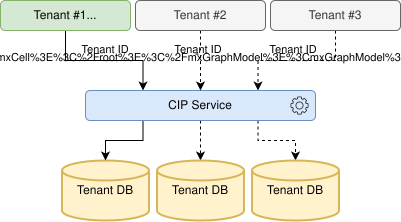

# Database Multitenancy

## Description

---

### Overview

To enable isolated access to data in Cloud Integration Platform for different organization units multitenancy approach on database level is being supported. The multitenancy approach assumes that CIP can work with different configurations and input data sets at the same time via DBaaS, but these configurations and data should be isolated from one another (per Tenant).

> ℹ️ Currently, multitenancy logic is available in a very limited way, that means that common CIP capabilities are fully available **ONLY** for **default** tenant (that is being created during the cloud core deployment).
>
> Please consider some known constraints:
>
> - There is no tenant id in the metrics, tracing and DPT events, hence there is not possibility to differentiate between tenants
> - There are conflict with libs, that appears with non-default tenant
> - Imported environment variables are being settled for each available tenant

**CIP DB multitenancy**

Each user has the access only for its tenant data (chains, services, etc.)

### **Key aspects**

- The same user (with the same credentials) can be registered under different tenants and have access to corresponding data.

- The chain can be triggered only by tenant which created and deployed the chain. Tenant validation rules for different triggers:

  | Trigger                                                                                                               | Rules                                                                                                                                                                                                                                                                                                                                                                                                                                                                                                                     |
  |:----------------------------------------------------------------------------------------------------------------------|:--------------------------------------------------------------------------------------------------------------------------------------------------------------------------------------------------------------------------------------------------------------------------------------------------------------------------------------------------------------------------------------------------------------------------------------------------------------------------------------------------------------------------|
  | [HTTP Trigger](../../01__Chains/1__Graph/1__Elements_Library/6__Triggers/1__HTTP_Trigger/http_trigger.md)             | Firstly, system will be looking for tenant id in **auth token.** In case token will not contain such information, header ***"Tenant"*** will be checked instead. If request does not contain tenant details, then Cloud Integration Platform sets tenant as "**default**". In case of invalid tenant, *system will replywith* ***404 Not found***.   ℹ️ When there are multiple chains available with an identical endpoint, the route of the request will be identified by pair of **HTTP path** *+* **Tenant**. |
  | [Kafka Trigger](../../01__Chains/1__Graph/1__Elements_Library/6__Triggers/8__Kafka_Trigger/kafka_trigger.md)          | Header **"Tenant"** in request will be checked. In case of invalid value system ignores the request ([session] will not be created).                                                                                                                                                                                                                                                                                                                                                                                      |
  | [AsyncAPI Trigger](../../01__Chains/1__Graph/1__Elements_Library/6__Triggers/3__AsyncAPI_Trigger/asyncapi_trigger.md) | Header "Tenant" in request will be checked. In case of invalid value system ignores the request (session will not be created).                                                                                                                                                                                                                                                                                                                                                                                            |
  | [RabbitMQ Trigger](../../01__Chains/1__Graph/1__Elements_Library/6__Triggers/6__RabbitMQ_Trigger/rabbitmq_trigger.md) | Header "Tenant" in request will be checked. In case of invalid value system ignores the request (session will not be created).                                                                                                                                                                                                                                                                                                                                                                                            |
  | [JMS Trigger](../../01__Chains/1__Graph/1__Elements_Library/6__Triggers/9__JMS_Trigger/jms_trigger.md)                | Header "Tenant" in request will be checked. In case of invalid value system ignores the request (session will not be created).                                                                                                                                                                                                                                                                                                                                                                                            |
  | [Scheduler](../../01__Chains/1__Graph/1__Elements_Library/6__Triggers/5__Scheduler/scheduler.md)                      | The process for mentioned Triggers will be utilizing the tenant that contains current chain.                                                                                                                                                                                                                                                                                                                                                                                                                              |
  | [SFTP Trigger](../../01__Chains/1__Graph/1__Elements_Library/6__Triggers/4__SFTP_Trigger/sftp_trigger.md)             | The process for mentioned Triggers will be utilizing the tenant that contains current chain.                                                                                                                                                                                                                                                                                                                                                                                                                              |
  | [Chain Trigger](../../01__Chains/1__Graph/1__Elements_Library/6__Triggers/2__Chain_Trigger/chain_trigger.md)          | Tenant will be propagated from the context of the calling chain.                                                                                                                                                                                                                                                                                                                                                                                                                                                          |

## Process initialization

---

The process will be initialized by login to UI application under particular tenant. The parameter domain on the 1st CIP login page have to be filled with the tenant name.

## User interface

---

The user have to input tenant name on the Web UI login page. In case of successful login you can click the icon  to see current tenant details.

## Data storage

---

All tenants are stored and managed in [Tenant manager] Cloud Core service.

## Configuration

---

Tenants should be created in tenant manager and user should be registered under particular tenant(s) in **IDP**.
